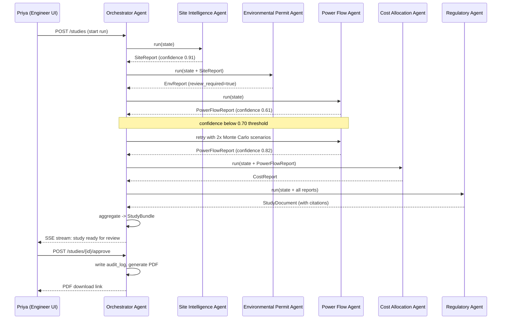
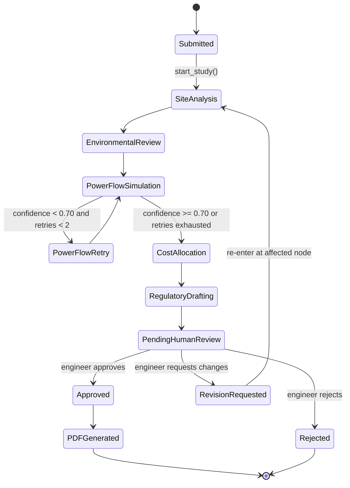
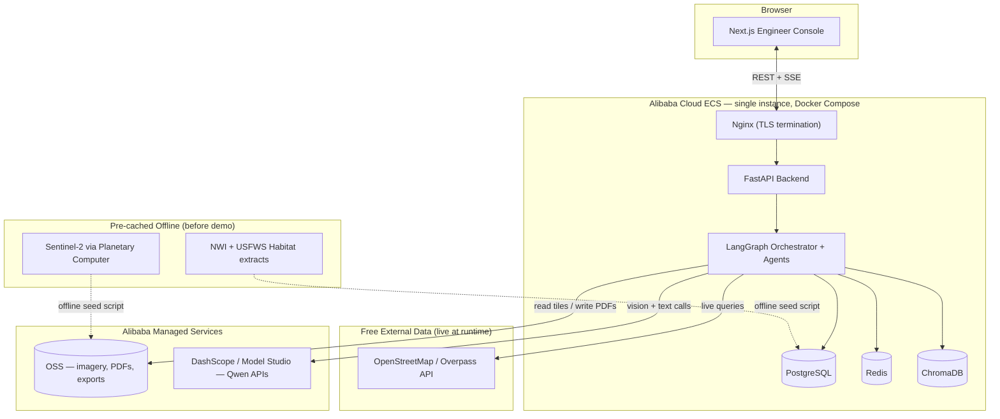
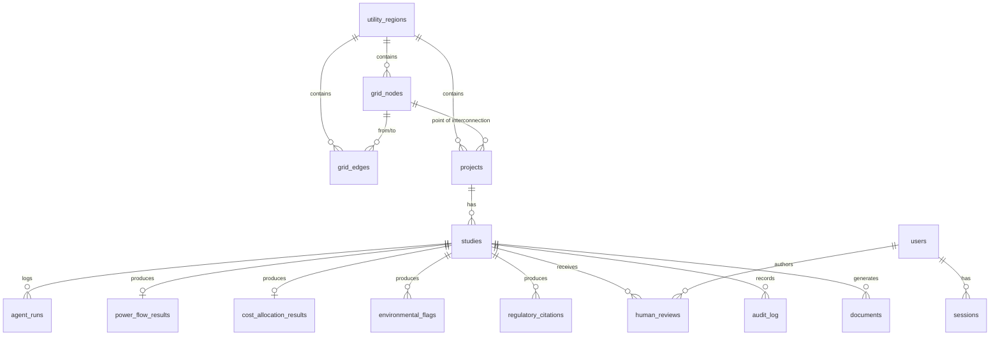
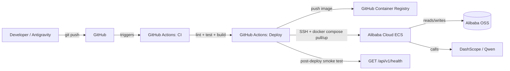

# GridPilot — Engineering Design Document

**An Autonomous Grid Interconnection Planning Agent**
*Internal Engineering Specification — v1.0*

**Build environment:** This document is written for a solo developer building almost entirely inside **Antigravity** (AI coding IDE), with assist from Claude Code / Cursor-class tooling. Every section is structured so a single module can be handed to the AI IDE, generated, tested, and merged without needing the rest of the system to exist yet.

**Scope discipline:** This is a hackathon MVP, not a utility system. We simulate **one utility region, one synthetic transmission network, one renewable interconnection project, and one human engineer review**. Every architectural decision below is optimized for that scope — not for handling a real ISO's queue.

---

## Table of Contents

1. [Vision](#vision)
2. [Problem](#problem)
3. [Existing Solutions](#existing-solutions)
4. [Why They Fail](#why-they-fail)
5. [Our Innovation](#our-innovation)
6. [Product Philosophy](#product-philosophy)
7. [Product Scope](#product-scope)
8. [Features](#features)
9. [User Personas](#user-personas)
10. [Complete User Journey](#complete-user-journey)
11. [End-to-End Workflow](#end-to-end-workflow)
12. [Multi-Agent Architecture](#multi-agent-architecture)
13. [Agent Communication Diagram](#agent-communication-diagram)
14. [Workflow State Machine](#workflow-state-machine)
15. [Memory Architecture](#memory-architecture)
16. [Database Design](#database-design)
17. [ChromaDB Design](#chromadb-design)
18. [Folder Structure](#folder-structure)
19. [Backend Architecture](#backend-architecture)
20. [Frontend Architecture](#frontend-architecture)
21. [API Design](#api-design)
22. [Tool Calling Design](#tool-calling-design)
23. [Qwen Model Usage](#qwen-model-usage)
24. [Free Datasets](#free-datasets)
25. [Satellite Imagery Pipeline](#satellite-imagery-pipeline)
26. [Simplified Grid Simulation Architecture](#simplified-grid-simulation-architecture)
27. [Human Review System](#human-review-system)
28. [Audit Trail](#audit-trail)
29. [Error Recovery](#error-recovery)
30. [Authentication](#authentication)
31. [Security](#security)
32. [Scalability](#scalability)
33. [Alibaba Cloud Deployment](#alibaba-cloud-deployment)
34. [Docker Architecture](#docker-architecture)
35. [CI/CD](#cicd)
36. [Monitoring](#monitoring)
37. [Logging](#logging)
38. [Cost Optimization](#cost-optimization)
39. [UI Screens](#ui-screens)
40. [Design System](#design-system)
41. [Mermaid Diagrams](#mermaid-diagrams)
42. [Build Phases](#build-phases)
43. [5-Day Hackathon Plan](#5-day-hackathon-plan)
44. [Must Have / Nice to Have / Cut List](#must-have--nice-to-have--cut-list)
45. [3-Minute Demo Script](#3-minute-demo-script)
46. [Judge WOW Moments](#judge-wow-moments)
47. [Future Startup Vision](#future-startup-vision)
48. [Judge Self-Review & Weak Point Pass](#judge-self-review--weak-point-pass)

---

## Vision

GridPilot proves that a swarm of narrow, auditable AI agents can pre-solve the bulk of a renewable energy interconnection study before a licensed engineer ever opens the file — turning a process that takes utilities **weeks of manual power-flow simulation and cross-referencing** into a **minutes-long autonomous draft**, with every claim traceable to a data source and every risky decision routed to a human.

GridPilot is not trying to replace the interconnection engineer. It is trying to replace the **first 90% of their workday** — the part spent re-running the same simulations, re-reading the same tariff clauses, and re-checking the same wetlands maps — so the engineer spends their limited, expensive, legally-mandated judgment on the 10% that actually needs it.

The long-term product vision is **infrastructure software for utilities and ISOs**: a system every developer building generation, storage, or data-center load eventually routes their interconnection request through, the way payments routes through Stripe.

## Problem

Renewable and storage developers file an interconnection request and then wait. As of the most recent national interconnection queue data, well over 2 terawatts of generation and storage capacity are sitting in U.S. interconnection queues, and the median project now takes years longer to reach commercial operation than it takes to physically build. Most of that delay isn't grid physics — it's **process**: a small number of licensed engineers per utility manually re-running power-flow studies, manually re-reading regulatory tariffs, and manually re-checking environmental constraints, one project at a time, in strict sequence.

Every year of delay burns financing carry costs, forces PPA renegotiation, and risks the loss of tax-credit eligibility windows. Multiplied across a queue of thousands of projects, this is a systemic bottleneck standing directly between the grid and both the clean energy transition and the data-center power buildout the AI industry itself depends on.

The bottleneck is not a lack of computing power. It's a lack of **software that can reason across land-use permits, transformer thermal limits, environmental review documents, and cost-allocation rules simultaneously** — the way a senior interconnection engineer does in their head, except at scale and without the multi-week backlog.

## Existing Solutions

- **Legacy simulation tools (PSS/E, PowerWorld, DIgSILENT):** Powerful, accurate, industry-standard power-flow solvers — but they are single-player desktop tools operated manually by licensed engineers. They don't ingest satellite imagery, they don't read tariff PDFs, and they don't orchestrate a multi-step review. They are the *engine*, not the *workflow*.
- **Queue data marketplaces (Anza, GridStatus, LandGate):** Expose interconnection queue status, historical timelines, and land data through dashboards and APIs. Extremely useful for developers deciding *where* to file — but they do none of the actual engineering study work. They report on the bottleneck; they don't relieve it.
- **Generic document-AI tools:** "AI that reads interconnection PDFs" or generic RAG-over-tariffs chatbots solve the easiest 5% of the workflow — text retrieval — while leaving the actual multi-week simulation and cross-referencing process completely manual.
- **GIS/environmental screening tools (EPA EJScreen, USFWS IPaC, state siting tools):** Good at flagging a single constraint type (wetlands, habitat, environmental justice) in isolation. None of them combine that signal with grid capacity data or cost implications.

## Why They Fail

They fail for the same structural reason: **each tool solves one slice of a workflow that is inherently cross-domain**. An interconnection study is simultaneously a GIS problem, a circuit-physics problem, a regulatory-reading problem, a cost-negotiation problem, and a legal-liability problem (the PE stamp). No point solution can win because the *actual* bottleneck is the human effort spent **manually gluing these domains together** — pulling a power-flow result, cross-checking it against a tariff clause, cross-checking that against a wetlands map, and writing it all up in a defensible document.

Point-solution AI companies fail for an additional reason: the real deliverable at the end of an interconnection study is a **legally defensible engineering document that requires a professional engineer's stamp**. No AI-native company has built a system that can autonomously draft that document *and* route it through the exact human-approval choke point regulators require — because doing that credibly requires an orchestration layer, not a single model call.

## Our Innovation

GridPilot doesn't try to replace the engineer, and it doesn't try to be one more point solution. It is an **orchestration layer**: a swarm of narrow agents, each an expert in exactly one domain (site imagery, circuit physics, cost math, regulatory text, environmental screening), coordinated by a workflow engine that treats every agent output as a **probabilistic claim with a confidence score**, not a binary fact.

- Low-confidence claims **automatically trigger deeper simulation** (finer Monte Carlo grid) before anything reaches a human.
- High-confidence, low-risk claims **flow straight through** to the draft study.
- Everything — every tool call, every model output, every retry — is written to an **immutable audit trail**, so a human engineer (or a regulator) can reconstruct exactly how the system arrived at any conclusion.
- The system's **memory compounds**: every completed study — approved or rejected — becomes a labeled example that future studies retrieve against, so the system's confidence calibration improves with every real project it processes, without retraining a model.

The net effect: a five-year queue process is compressed into a workflow where **90% of the study is pre-solved before a human opens it**, and the human sees exactly which 10% needs their judgment and why.

## Product Philosophy

1. **Confidence over certainty.** Every agent output carries a numeric confidence score and an explicit list of assumptions. Nothing is presented to a human as fact when it is actually an estimate.
2. **Human-in-the-loop is a feature, not a limitation.** The PE stamp requirement isn't a constraint we route around — it's the trust anchor the entire product is built to serve. We make the human's job faster, never optional.
3. **Auditability by construction.** If an output can't be traced to a tool call, a data source, and a timestamp, it doesn't ship. This is what separates infrastructure software from a chatbot demo.
4. **Narrow agents, wide orchestration.** Each agent should be small enough that a single engineer (or a single AI-IDE session) can fully understand, test, and rebuild it in isolation. Intelligence comes from composition, not from one enormous prompt.
5. **Simulate the shape of the industry, not its scale.** The MVP proves the architecture pattern on one project, one region, one network. The architecture is designed so that scaling to more projects, regions, and networks is a *configuration* change, not a *rewrite*.
6. **Free-tier-first engineering.** Every dependency, dataset, and cloud service in this document is free or has a generous free tier. Nothing in the MVP requires a purchase.

## Product Scope

**In scope for the MVP:**
- One synthetic utility region ("Sagebrush Electric Cooperative," fictional, loosely modeled on a real U.S. rural/solar-heavy service territory)
- One synthetic transmission/sub-transmission network (8–15 buses, built with NetworkX + PyPSA, loosely georeferenced to a real-world AOI for realistic satellite imagery)
- One renewable interconnection project (a 50 MW solar + 20 MW storage project) submitted through a form
- Five specialized agents + one orchestrator, running an end-to-end study
- One human engineer review screen with approve / request-changes / reject actions
- A full audit trail of the entire run
- A generated, downloadable interconnection study document (PDF)

**Explicitly out of scope for the MVP** (see [Future Startup Vision](#future-startup-vision)):
- Multiple concurrent projects competing for the same network capacity ("cluster study" game theory)
- Real utility tariff ingestion at scale (500+ page PDF parsing across many ISOs)
- Real AC power-flow at utility-grade accuracy (we use simplified DC power flow — see [Simplified Grid Simulation Architecture](#simplified-grid-simulation-architecture))
- Multi-tenant SaaS, billing, or org-level RBAC
- Real e-filing integration with an ISO queue portal
- Kubernetes, multi-region deployment, or managed graph/vector databases at enterprise scale

## Features

| Feature | Description | Priority |
|---|---|---|
| Project intake form | Developer submits project name, capacity (MW), technology, point of interconnection, AOI (map-drawn polygon) | Must Have |
| Autonomous multi-agent study run | Orchestrator sequences 5 agents end-to-end with live progress | Must Have |
| Site Intelligence report | Satellite + OSM-derived land suitability, wetlands proximity, transmission corridor proximity | Must Have |
| Power flow simulation | DC power flow + Monte Carlo confidence scoring for thermal/voltage violations | Must Have |
| Cost allocation estimate | Network upgrade cost attribution for the interconnecting project | Must Have |
| Regulatory study draft | Auto-drafted technical study document with citations to a small regulatory corpus | Must Have |
| Environmental permit flags | Wetlands/habitat conflict detection from free datasets | Must Have |
| Confidence-based routing | Low-confidence branches auto-retry with finer simulation before reaching a human | Must Have |
| Human review console | Engineer sees every agent's output, confidence, and sources; approves/rejects/comments | Must Have |
| Immutable audit log | Every tool call, model call, and human action is logged with timestamps | Must Have |
| Downloadable study PDF | Final output is a real, professional PDF document | Must Have |
| Live agent activity feed (SSE) | Judges watch agents work in real time during the demo | Nice to Have |
| Grid topology map view | Interactive Leaflet map of the synthetic network + AOI + satellite tile | Nice to Have |
| Historical outcome memory | Vector search over prior (seeded, synthetic) study outcomes to inform new studies | Nice to Have |
| Revision loop | Engineer requests changes; orchestrator re-runs only affected agents | Nice to Have |
| Multi-project cluster costing | Game-theoretic cost sharing across concurrent projects | Cut for MVP |

## User Personas

**1. Priya — Interconnection Engineer at Sagebrush Electric Cooperative (primary user)**
Licensed PE, 8 years at the utility, personally responsible for every study she stamps. She doesn't trust black boxes — she trusts systems that show their work. She is the sole approver in the MVP. Her success metric: time from "study assigned" to "study stamped" drops from weeks to under an hour of her active attention, without her trust in the output dropping.

**2. Dan — Renewable Developer (secondary user, project submitter)**
Project manager at a solar+storage developer. Submits the interconnection request and waits. His only interaction with GridPilot in the MVP is the intake form and (conceptually, future work) a status view. His pain is pure waiting; GridPilot's value to him is entirely indirect, via Priya's speed.

**3. Judge — Hackathon Evaluator (design-partner persona for this document)**
Technical evaluator with limited time, has seen a hundred "AI agent" demos this year. Needs to see, within 3 minutes: real orchestration (not one prompt), a real human-in-the-loop moment, real free/open data, and a defensible reason this becomes a company. Every UI screen and demo beat in this document is designed with this persona explicitly in mind.

## Complete User Journey

1. **Priya logs in** to the GridPilot engineer console (single-user auth for MVP — see [Authentication](#authentication)).
2. She sees a **queue view**: one project, "Sagebrush Solar + Storage — 50 MW / 20 MW," status `Submitted`.
3. She clicks **"Run Study."** This calls `POST /api/v1/projects/{id}/studies`, which creates a `study` row and kicks off the LangGraph orchestrator as a background task.
4. She's dropped onto a **live study screen**. An activity feed streams agent-by-agent progress over Server-Sent Events: `Site Intelligence Agent — running...`, `Site Intelligence Agent — complete (confidence 0.91)`, `Power Flow Agent — running Monte Carlo (200 scenarios)...`, etc.
5. One agent — Power Flow — comes back with **confidence 0.61**, below the 0.70 auto-continue threshold. The orchestrator **automatically retries** with a finer-grained simulation (more Monte Carlo scenarios) rather than presenting a shaky number to Priya. The UI shows this retry live: `Power Flow Agent — confidence below threshold, escalating to finer simulation...`.
6. The retry comes back at confidence 0.82. The orchestrator continues to Cost Allocation, then Regulatory Drafting.
7. Total elapsed time: **under two minutes** (in the demo; architected to scale to real workloads taking longer without changing the interaction model).
8. Priya is dropped onto the **Study Review screen**: a structured breakdown of every agent's findings, each with a confidence badge, its underlying data sources, and (for the Regulatory Agent) inline citations back to the small regulatory corpus.
9. One finding is flagged **"Needs Engineer Judgment"**: the Environmental Permit Agent found the project boundary is 340 meters from a mapped wetland buffer — inside the "review required" band but not an automatic rejection. Priya reads the flag, the underlying NWI polygon on the map, and the agent's reasoning.
10. She adds a comment, then clicks **Approve**. This is the PE-stamp moment — the human-in-the-loop choke point the entire regulatory story depends on.
11. GridPilot generates the final **interconnection study PDF**, stores it in OSS, and marks the study `Approved`.
12. The full **audit trail** — every tool call, every model call, every retry, every human action — is available as a timestamped, append-only log, exportable as JSON.

## End-to-End Workflow

```
Submit Project
      │
      ▼
Orchestrator initializes StudyState (LangGraph)
      │
      ▼
┌─────────────────────────────┐
│ Site Intelligence Agent      │──> writes SiteReport, confidence
└─────────────────────────────┘
      │
      ▼
┌─────────────────────────────┐
│ Environmental Permit Agent   │──> writes EnvReport, confidence
└─────────────────────────────┘
      │
      ▼
┌─────────────────────────────┐
│ Power Flow Agent              │──> writes PowerFlowReport, confidence
└─────────────────────────────┘
      │
      ├── confidence < 0.70 ──> retry with finer Monte Carlo (max 2 retries)
      │                              │
      │◄─────────────────────────────┘
      ▼ confidence >= 0.70
┌─────────────────────────────┐
│ Cost Allocation Agent         │──> writes CostReport
└─────────────────────────────┘
      │
      ▼
┌─────────────────────────────┐
│ Regulatory Agent              │──> drafts StudyDocument w/ citations
└─────────────────────────────┘
      │
      ▼
Orchestrator aggregates all reports → StudyBundle
      │
      ▼
Human Review (Priya) ──> Approve / Request Changes / Reject
      │                          │
      │                          └──> Request Changes re-enters graph
      │                               at the affected agent node only
      ▼
PDF generated, stored in OSS, Audit Trail finalized
```

Every arrow in this diagram is a real LangGraph edge, not prose — see [Workflow State Machine](#workflow-state-machine) for the executable version.

## Multi-Agent Architecture

**Architectural decision:** all agents run **in-process, as Python modules invoked by a LangGraph `StateGraph`**, inside the single FastAPI backend service — not as separate microservices communicating over HTTP. This is a deliberate simplification for a solo dev on a 5-day clock: it removes network calls, service discovery, and inter-service auth from the critical path, while still keeping every agent in its **own directory with a clean function-call interface** (`run(state) -> AgentResult`), so the boundary is a Python import today and a network call tomorrow if the product ever needs to scale agents independently. Every agent is independently unit-testable by calling `run()` with a fixture `state` — no orchestrator required.

Each agent is a **pure-ish function**: `AgentInput -> AgentOutput`, where `AgentOutput` always includes `confidence: float`, `sources: list[Source]`, `assumptions: list[str]`, and `raw_model_output: str` for audit purposes. Agents do not call each other directly — all coordination goes through the Orchestrator, which is the only component allowed to read/write the shared `StudyState`. This keeps every agent testable in isolation and keeps the dependency graph a strict DAG.

---

### Agent 1 — Site Intelligence Agent

**Directory:** `agents/site_intelligence/`

- **Responsibilities:** Assess land suitability at the project's point of interconnection (POI) using satellite imagery + OpenStreetMap vector data. Determine proximity to existing transmission corridors, land cover type, and any obvious visual conflicts (e.g., existing structures, water bodies) inside the project polygon.
- **Inputs:** `project.aoi_geojson` (developer-drawn polygon), pre-cached Sentinel-2 imagery tile reference (OSS key), OSM feature query results for the bounding box.
- **Outputs:** `SiteReport { land_cover_summary, distance_to_nearest_transmission_line_m, distance_to_nearest_substation_m, visual_flags: list[str], confidence, sources }`
- **Memory usage:** Reads from **semantic memory** (ChromaDB `prior_study_outcomes` collection) for similar-AOI precedent ("has a project this close to a corridor been approved before?"). Writes nothing to long-term memory directly — the Orchestrator writes the final outcome after human review.
- **Failure cases:** OSS imagery key missing/corrupt → falls back to an OSM-only assessment with confidence capped at 0.6 and an explicit `assumptions` entry. Overpass API timeout → retries once with exponential backoff, then falls back to a smaller bounding box.
- **Retry strategy:** Up to 2 retries on tool failure (not on low confidence — low confidence here is a valid, reportable outcome, not an error). Retry budget tracked in `agent_runs.retry_count`.
- **Communication with other agents:** Output is consumed by the Environmental Permit Agent (shares the same AOI + imagery) and by the Regulatory Agent (cites land-use findings in the drafted document).

### Agent 2 — Environmental Permit Agent

**Directory:** `agents/environmental_permit/`

- **Responsibilities:** Cross-reference the project AOI against free wetlands/habitat datasets and flag potential NEPA/state-environmental-review triggers. Produce a plain-language conflict summary an engineer can act on.
- **Inputs:** `project.aoi_geojson`, `SiteReport` (from Agent 1), pre-processed National Wetlands Inventory (NWI) extract for the demo region, pre-processed USFWS critical habitat extract.
- **Outputs:** `EnvReport { wetland_conflicts: list[Conflict], habitat_conflicts: list[Conflict], nearest_conflict_distance_m, review_required: bool, confidence, sources }`
- **Memory usage:** Reads `environmental_corpus` ChromaDB collection (chunked, embedded synthetic environmental-filing precedent text) to phrase its summary in language consistent with prior filings.
- **Failure cases:** Geometry intersection error (malformed polygon) → returns `review_required: true` with confidence 0.0 and a hard escalation flag — **never silently passes** a geometry error as "no conflict found." This is a deliberate fail-safe: environmental findings fail closed, not open.
- **Retry strategy:** No retry on geometry errors (deterministic — retrying won't fix bad input); immediate escalation to orchestrator's error-recovery node instead.
- **Communication with other agents:** Feeds into the Regulatory Agent's drafted document and directly into the Orchestrator's human-escalation logic (a `review_required: true` always forces a human touchpoint regardless of other agents' confidence).

### Agent 3 — Power Flow Agent

**Directory:** `agents/power_flow/`

- **Responsibilities:** Model the interconnecting project's injection onto the synthetic transmission network and detect thermal (line/transformer overload) and voltage violations using simplified DC power flow, run across a Monte Carlo ensemble of loading scenarios to produce a confidence-scored risk assessment rather than a single deterministic pass/fail.
- **Inputs:** `project.capacity_mw`, `project.poi_bus_id`, the synthetic `grid_topology` (buses + lines from PostgreSQL), a scenario-generation config (number of Monte Carlo runs, load distribution parameters).
- **Outputs:** `PowerFlowReport { violation_probability, worst_case_line_loading_pct, worst_case_bus_voltage_pu, scenarios_run, confidence, sources }`
- **Memory usage:** No semantic memory read — this agent is pure computation (PyPSA), not an LLM call for the numeric core. An LLM call *is* used afterward to translate the numeric result into a plain-language summary for the study document; that call reads no memory.
- **Failure cases:** PyPSA solver non-convergence on a scenario → that scenario is logged and excluded from the ensemble (not silently treated as "no violation"); if more than 15% of scenarios fail to converge, confidence is capped at 0.5 and the orchestrator is told to escalate.
- **Retry strategy:** This is the agent with the explicit confidence-triggered retry described in the workflow: if `confidence < 0.70`, the Orchestrator re-invokes this agent with `scenarios = scenarios * 2` (up to a hard cap of 800 scenarios / 2 retries) before giving up and escalating to a human with the best available number, clearly labeled as low-confidence.
- **Communication with other agents:** Output feeds Cost Allocation (violations drive upgrade cost estimates) and Regulatory Agent (cites the specific violated element, e.g., "Line 4–7 loaded to 104% under P95 scenario").

### Agent 4 — Cost Allocation Agent

**Directory:** `agents/cost_allocation/`

- **Responsibilities:** Translate the Power Flow Agent's violation findings into an estimated network-upgrade cost attributable to this project (e.g., transformer upgrade, line reconductoring), using a transparent, rule-based unit-cost table — not a black-box number. MVP scope is single-project cost attribution; the multi-project "cluster" cost-sharing negotiation described in the startup vision is explicitly deferred (see [Product Scope](#product-scope)).
- **Inputs:** `PowerFlowReport`, a `unit_cost_table` (synthetic but realistic $/MVA and $/mile figures, seeded in Postgres, sourced and labeled as illustrative).
- **Outputs:** `CostReport { upgrades_required: list[Upgrade], total_estimated_cost_usd, cost_basis_notes, confidence, sources }`
- **Memory usage:** None required — deterministic lookup + arithmetic, wrapped with an LLM call only to generate the human-readable cost narrative.
- **Failure cases:** Missing unit cost for a required upgrade type → returns a partial estimate with the missing line item explicitly flagged (`upgrades_required[i].cost_estimated = false`) rather than omitting it silently.
- **Retry strategy:** None needed (deterministic); errors escalate immediately.
- **Communication with other agents:** Feeds the Regulatory Agent, which embeds the cost breakdown into the drafted study document.

### Agent 5 — Regulatory Agent

**Directory:** `agents/regulatory/`

- **Responsibilities:** Draft the technical interconnection study document itself — the actual deliverable — by synthesizing the outputs of the four upstream agents into utility-standard prose, with inline citations back to a small seeded regulatory/tariff corpus (simplified FERC Order 2023 cluster-study concepts + one synthetic state PUC tariff excerpt).
- **Inputs:** `SiteReport`, `EnvReport`, `PowerFlowReport`, `CostReport`, and retrieved chunks from the `regulatory_corpus` ChromaDB collection.
- **Outputs:** `StudyDocument { sections: list[Section], citations: list[Citation], overall_confidence, sources }` — this is later rendered to PDF (see [Free Datasets](#free-datasets) and document generation in [Backend Architecture](#backend-architecture)).
- **Memory usage:** Heaviest semantic-memory consumer — retrieves top-k chunks from `regulatory_corpus` per section it drafts (site suitability, power flow findings, cost allocation, environmental review), so every section it writes is grounded in a retrieved passage rather than free-generated regulatory claims.
- **Failure cases:** Retrieval returns zero relevant chunks for a section → the agent explicitly writes "no directly applicable tariff provision found; engineer discretion required" instead of fabricating a citation. This is enforced by prompt instruction *and* a post-generation citation-existence check (every citation ID in the output must exist in the retrieved-chunk set, or the section is flagged for human review).
- **Retry strategy:** One retry with a stricter "cite only from provided chunks" system prompt if the citation-existence check fails; if it fails twice, the section ships un-cited and flagged.
- **Communication with other agents:** Terminal agent in the DAG — output goes to the Orchestrator for final aggregation and to the Human Review screen, not to another agent.

### Agent 6 — Portfolio Orchestrator Agent

**Directory:** `agents/orchestrator/`

- **Responsibilities:** Owns the `StudyState`, sequences the five agents above via a LangGraph `StateGraph`, evaluates confidence thresholds after each node, triggers retries or escalations, resolves cases where two agents' findings conflict (e.g., Site Intelligence says "clear" but Environmental says "review required" — the orchestrator applies a deterministic **most-conservative-wins** rule, never an LLM vote), and is the only component that writes to the audit log.
- **Inputs:** The initial `Project` record and, on resume, the persisted `StudyState` (see [Error Recovery](#error-recovery) for exactly-once resumability).
- **Outputs:** The aggregated `StudyBundle` presented to the human reviewer, plus every intermediate state transition written to `agent_runs` and `audit_log`.
- **Memory usage:** Writes to **audit memory** continuously; on study completion (post human-review), writes a summary embedding to `prior_study_outcomes` in ChromaDB so future Site Intelligence and Regulatory agents can retrieve this outcome as precedent.
- **Failure cases:** Any agent exhausting its retry budget → orchestrator marks that node `escalated`, continues the graph where possible (independent branches still run), and surfaces the escalation clearly in the human review UI rather than blocking the entire study.
- **Retry strategy:** The orchestrator itself doesn't retry — it *decides* whether an agent should. Its own crash recovery is handled structurally: `StudyState` is checkpointed to Postgres after every node (LangGraph checkpointing), so a process restart resumes from the last completed node rather than re-running the whole study.
- **Communication with other agents:** Hub-and-spoke — every agent's input and output passes through the orchestrator; agents never call each other directly.

## Agent Communication Diagram



## Workflow State Machine

The orchestrator is implemented as a LangGraph `StateGraph`. Every transition below is a real graph edge with a real conditional function — this is the literal control flow, not an illustration.



**State persistence:** every node transition writes a row to `agent_runs` (see [Database Design](#database-design)) and checkpoints the full `StudyState` (a Pydantic model, serialized to JSONB) to the `studies.state_snapshot` column. If the backend process restarts mid-study, the orchestrator reloads the last snapshot and resumes at the next node — it never silently restarts a completed node, which matters both for cost (no re-billing Qwen calls) and for audit integrity (no duplicate audit entries).

## Memory Architecture

GridPilot uses five distinct memory types, each with a different lifetime, storage engine, and purpose. Conflating these (as many agent demos do) is a common source of both bugs and unauditable behavior — so each is implemented as a **separate, explicitly-named interface** in `services/memory/`.

| Memory type | Lifetime | Storage | Purpose | Read by | Written by |
|---|---|---|---|---|---|
| **Short-term (working) memory** | Single study run | In-memory `StudyState` (Pydantic), checkpointed to Postgres JSONB | Passes agent outputs to downstream agents within one run | All agents | Orchestrator |
| **Session memory** | One browser session | Redis (key = session token) | UI state — which study is open, SSE connection state, in-progress form drafts | Frontend via API | API layer |
| **Long-term structured memory** | Permanent | PostgreSQL (`studies`, `agent_runs`, `human_reviews` tables) | The system of record — every study ever run, queryable by SQL | Analytics, judge demo, future studies | Orchestrator, human review endpoint |
| **Semantic (vector) memory** | Permanent, grows over time | ChromaDB, 3 collections (see [ChromaDB Design](#chromadb-design)) | Retrieval-augmented grounding: prior outcomes, regulatory text, environmental precedent | Site Intelligence, Regulatory, Environmental Permit agents | Orchestrator (on study completion), offline seed scripts |
| **Audit memory** | Permanent, append-only, immutable | PostgreSQL `audit_log` table (insert-only, no UPDATE/DELETE grants at the DB role level) | Legal/regulatory defensibility — reconstruct exactly what happened and why | Human Review screen, exported JSON | Orchestrator only |

**Why semantic memory compounds the product's moat:** every approved *or rejected* study, once completed, is summarized and embedded into `prior_study_outcomes`. The next time the Site Intelligence Agent sees a project close to a similar AOI, or the Regulatory Agent drafts a similar finding, it retrieves that precedent. Study #500 is measurably better-grounded than study #1 — without touching model weights. This is the same "gets smarter from real outcomes" property described in the original concept doc, implemented with a vector store instead of a bespoke graph database, because a vector store is dramatically simpler to stand up solo in five days and still delivers the retrieval behavior that matters for the demo.

## Database Design

Single PostgreSQL 16 instance (Docker container on the ECS host, or free-tier ApsaraDB RDS if the trial credit is available — see [Alibaba Cloud Deployment](#alibaba-cloud-deployment)). One schema, `gridpilot`. All primary keys are UUIDv7 (`uuid_generate_v7()` via the `pg_uuidv7` extension, or app-generated if the extension isn't available) so IDs are naturally time-sortable — useful for the audit log and for AI-IDE-generated code that needs predictable ordering without a separate `created_at` sort in hot paths.

```sql
CREATE SCHEMA IF NOT EXISTS gridpilot;
SET search_path TO gridpilot;

-- ============================================================
-- USERS & AUTH
-- ============================================================
CREATE TABLE users (
    id              UUID PRIMARY KEY DEFAULT gen_random_uuid(),
    email           TEXT NOT NULL UNIQUE,
    display_name    TEXT NOT NULL,
    role            TEXT NOT NULL DEFAULT 'engineer' CHECK (role IN ('engineer', 'admin')),
    password_hash   TEXT NOT NULL,
    created_at      TIMESTAMPTZ NOT NULL DEFAULT now()
);

CREATE TABLE sessions (
    id              UUID PRIMARY KEY DEFAULT gen_random_uuid(),
    user_id         UUID NOT NULL REFERENCES users(id) ON DELETE CASCADE,
    token_hash      TEXT NOT NULL UNIQUE,
    expires_at      TIMESTAMPTZ NOT NULL,
    created_at      TIMESTAMPTZ NOT NULL DEFAULT now()
);
CREATE INDEX idx_sessions_user_id ON sessions(user_id);
CREATE INDEX idx_sessions_expires_at ON sessions(expires_at);

-- ============================================================
-- GRID TOPOLOGY (synthetic network)
-- ============================================================
CREATE TABLE utility_regions (
    id              UUID PRIMARY KEY DEFAULT gen_random_uuid(),
    name            TEXT NOT NULL,
    description     TEXT,
    boundary_geojson JSONB NOT NULL,
    created_at      TIMESTAMPTZ NOT NULL DEFAULT now()
);

CREATE TABLE grid_nodes (
    id                  UUID PRIMARY KEY DEFAULT gen_random_uuid(),
    region_id           UUID NOT NULL REFERENCES utility_regions(id) ON DELETE CASCADE,
    node_key            TEXT NOT NULL,           -- human-readable bus id, e.g. "BUS-04"
    node_type           TEXT NOT NULL CHECK (node_type IN ('substation', 'generator_bus', 'load_bus')),
    voltage_kv          NUMERIC(6,2) NOT NULL,
    latitude             NUMERIC(9,6) NOT NULL,
    longitude            NUMERIC(9,6) NOT NULL,
    thermal_limit_mva    NUMERIC(8,2),
    created_at            TIMESTAMPTZ NOT NULL DEFAULT now(),
    UNIQUE (region_id, node_key)
);
CREATE INDEX idx_grid_nodes_region_id ON grid_nodes(region_id);

CREATE TABLE grid_edges (
    id                  UUID PRIMARY KEY DEFAULT gen_random_uuid(),
    region_id           UUID NOT NULL REFERENCES utility_regions(id) ON DELETE CASCADE,
    from_node_id         UUID NOT NULL REFERENCES grid_nodes(id) ON DELETE CASCADE,
    to_node_id           UUID NOT NULL REFERENCES grid_nodes(id) ON DELETE CASCADE,
    edge_type            TEXT NOT NULL CHECK (edge_type IN ('line', 'transformer')),
    length_miles          NUMERIC(6,2),
    reactance_pu          NUMERIC(8,5) NOT NULL,
    thermal_limit_mva     NUMERIC(8,2) NOT NULL,
    created_at            TIMESTAMPTZ NOT NULL DEFAULT now()
);
CREATE INDEX idx_grid_edges_region_id ON grid_edges(region_id);
CREATE INDEX idx_grid_edges_from_node ON grid_edges(from_node_id);
CREATE INDEX idx_grid_edges_to_node ON grid_edges(to_node_id);

-- ============================================================
-- PROJECTS & STUDIES
-- ============================================================
CREATE TABLE projects (
    id                  UUID PRIMARY KEY DEFAULT gen_random_uuid(),
    region_id           UUID NOT NULL REFERENCES utility_regions(id),
    poi_node_id          UUID NOT NULL REFERENCES grid_nodes(id),
    name                 TEXT NOT NULL,
    technology            TEXT NOT NULL CHECK (technology IN ('solar', 'storage', 'solar_plus_storage', 'wind')),
    capacity_mw           NUMERIC(7,2) NOT NULL,
    storage_capacity_mw   NUMERIC(7,2),
    aoi_geojson            JSONB NOT NULL,
    submitted_by           TEXT,
    status                  TEXT NOT NULL DEFAULT 'submitted'
                              CHECK (status IN ('submitted', 'in_study', 'pending_review', 'approved', 'rejected')),
    created_at              TIMESTAMPTZ NOT NULL DEFAULT now(),
    updated_at              TIMESTAMPTZ NOT NULL DEFAULT now()
);
CREATE INDEX idx_projects_region_id ON projects(region_id);
CREATE INDEX idx_projects_status ON projects(status);

CREATE TABLE studies (
    id                  UUID PRIMARY KEY DEFAULT gen_random_uuid(),
    project_id           UUID NOT NULL REFERENCES projects(id) ON DELETE CASCADE,
    status                TEXT NOT NULL DEFAULT 'running'
                            CHECK (status IN ('running', 'pending_review', 'revision_requested', 'approved', 'rejected', 'failed')),
    state_snapshot        JSONB NOT NULL DEFAULT '{}',   -- LangGraph checkpoint (StudyState)
    overall_confidence     NUMERIC(4,3),
    study_document_json    JSONB,                          -- StudyDocument before PDF render
    pdf_oss_key             TEXT,                            -- OSS object key once generated
    started_at              TIMESTAMPTZ NOT NULL DEFAULT now(),
    completed_at             TIMESTAMPTZ
);
CREATE INDEX idx_studies_project_id ON studies(project_id);
CREATE INDEX idx_studies_status ON studies(status);
CREATE INDEX idx_studies_state_snapshot_gin ON studies USING GIN (state_snapshot);

-- ============================================================
-- AGENT EXECUTION LOG
-- ============================================================
CREATE TABLE agent_runs (
    id                  UUID PRIMARY KEY DEFAULT gen_random_uuid(),
    study_id             UUID NOT NULL REFERENCES studies(id) ON DELETE CASCADE,
    agent_name            TEXT NOT NULL CHECK (agent_name IN
                             ('site_intelligence', 'environmental_permit', 'power_flow',
                              'cost_allocation', 'regulatory', 'orchestrator')),
    attempt_number         INTEGER NOT NULL DEFAULT 1,
    status                  TEXT NOT NULL CHECK (status IN ('running', 'succeeded', 'failed', 'escalated')),
    input_json               JSONB NOT NULL,
    output_json               JSONB,
    confidence                 NUMERIC(4,3),
    error_message               TEXT,
    qwen_model_used              TEXT,
    qwen_input_tokens             INTEGER,
    qwen_output_tokens            INTEGER,
    duration_ms                    INTEGER,
    started_at                      TIMESTAMPTZ NOT NULL DEFAULT now(),
    completed_at                     TIMESTAMPTZ
);
CREATE INDEX idx_agent_runs_study_id ON agent_runs(study_id);
CREATE INDEX idx_agent_runs_agent_name ON agent_runs(agent_name);

-- ============================================================
-- RESULTS (denormalized read models per agent domain)
-- ============================================================
CREATE TABLE power_flow_results (
    id                  UUID PRIMARY KEY DEFAULT gen_random_uuid(),
    study_id             UUID NOT NULL REFERENCES studies(id) ON DELETE CASCADE,
    scenarios_run          INTEGER NOT NULL,
    violation_probability   NUMERIC(4,3) NOT NULL,
    worst_case_line_id       UUID REFERENCES grid_edges(id),
    worst_case_loading_pct    NUMERIC(6,2),
    worst_case_bus_voltage_pu  NUMERIC(5,3),
    raw_results_json             JSONB NOT NULL,
    created_at                    TIMESTAMPTZ NOT NULL DEFAULT now()
);
CREATE INDEX idx_power_flow_results_study_id ON power_flow_results(study_id);

CREATE TABLE cost_allocation_results (
    id                  UUID PRIMARY KEY DEFAULT gen_random_uuid(),
    study_id             UUID NOT NULL REFERENCES studies(id) ON DELETE CASCADE,
    total_estimated_cost_usd  NUMERIC(12,2) NOT NULL,
    upgrades_json               JSONB NOT NULL,
    created_at                    TIMESTAMPTZ NOT NULL DEFAULT now()
);
CREATE INDEX idx_cost_allocation_results_study_id ON cost_allocation_results(study_id);

CREATE TABLE environmental_flags (
    id                  UUID PRIMARY KEY DEFAULT gen_random_uuid(),
    study_id             UUID NOT NULL REFERENCES studies(id) ON DELETE CASCADE,
    flag_type              TEXT NOT NULL CHECK (flag_type IN ('wetland', 'habitat', 'other')),
    severity                 TEXT NOT NULL CHECK (severity IN ('info', 'review_required', 'blocking')),
    distance_m                 NUMERIC(10,2),
    description                  TEXT NOT NULL,
    source_dataset                 TEXT NOT NULL,
    geometry_geojson                 JSONB,
    created_at                        TIMESTAMPTZ NOT NULL DEFAULT now()
);
CREATE INDEX idx_environmental_flags_study_id ON environmental_flags(study_id);

CREATE TABLE regulatory_citations (
    id                  UUID PRIMARY KEY DEFAULT gen_random_uuid(),
    study_id             UUID NOT NULL REFERENCES studies(id) ON DELETE CASCADE,
    section_name          TEXT NOT NULL,
    citation_text           TEXT NOT NULL,
    source_document           TEXT NOT NULL,
    chroma_chunk_id             TEXT NOT NULL,
    created_at                    TIMESTAMPTZ NOT NULL DEFAULT now()
);
CREATE INDEX idx_regulatory_citations_study_id ON regulatory_citations(study_id);

-- ============================================================
-- HUMAN REVIEW
-- ============================================================
CREATE TABLE human_reviews (
    id                  UUID PRIMARY KEY DEFAULT gen_random_uuid(),
    study_id             UUID NOT NULL REFERENCES studies(id) ON DELETE CASCADE,
    reviewer_id            UUID NOT NULL REFERENCES users(id),
    decision                 TEXT NOT NULL CHECK (decision IN ('approved', 'rejected', 'revision_requested', 'comment')),
    comment                    TEXT,
    affected_section              TEXT,   -- for revision_requested: which agent's finding to re-run
    created_at                      TIMESTAMPTZ NOT NULL DEFAULT now()
);
CREATE INDEX idx_human_reviews_study_id ON human_reviews(study_id);

-- ============================================================
-- AUDIT LOG (append-only, immutable)
-- ============================================================
CREATE TABLE audit_log (
    id                  UUID PRIMARY KEY DEFAULT gen_random_uuid(),
    study_id             UUID REFERENCES studies(id) ON DELETE CASCADE,
    project_id             UUID REFERENCES projects(id),
    actor_type               TEXT NOT NULL CHECK (actor_type IN ('agent', 'orchestrator', 'human', 'system')),
    actor_name                 TEXT NOT NULL,
    action                       TEXT NOT NULL,           -- e.g. "tool_call", "state_transition", "approval"
    detail_json                    JSONB NOT NULL,
    created_at                      TIMESTAMPTZ NOT NULL DEFAULT now()
);
CREATE INDEX idx_audit_log_study_id ON audit_log(study_id);
CREATE INDEX idx_audit_log_created_at ON audit_log(created_at);
-- Immutability enforced at the role level: the app DB role has INSERT + SELECT only on audit_log,
-- no UPDATE, no DELETE. Only a separate migrations role (never used at runtime) can alter the table.

-- ============================================================
-- DOCUMENTS (OSS-backed file references)
-- ============================================================
CREATE TABLE documents (
    id                  UUID PRIMARY KEY DEFAULT gen_random_uuid(),
    study_id             UUID REFERENCES studies(id) ON DELETE CASCADE,
    doc_type              TEXT NOT NULL CHECK (doc_type IN ('satellite_tile', 'study_pdf', 'audit_export')),
    oss_key                 TEXT NOT NULL,
    content_type              TEXT NOT NULL,
    size_bytes                  INTEGER,
    created_at                    TIMESTAMPTZ NOT NULL DEFAULT now()
);
CREATE INDEX idx_documents_study_id ON documents(study_id);
```

**Relationships at a glance:** `utility_regions 1—N grid_nodes 1—N grid_edges`, `utility_regions 1—N projects 1—N studies 1—N agent_runs`, `studies 1—1 power_flow_results / cost_allocation_results`, `studies 1—N environmental_flags / regulatory_citations / human_reviews / audit_log / documents`. Every foreign key cascades on delete **except** `audit_log`, which is designed to outlive the studies it references in a future multi-region version (kept `ON DELETE CASCADE` for MVP simplicity, flagged here as the first thing to change post-hackathon).

## ChromaDB Design

ChromaDB runs as a single Docker container (`chromadb/chroma`, persistent volume mounted to the ECS host disk — no managed vector DB needed for this scale). Three collections, each with a narrow, single-purpose embedding model call via DashScope (`text-embedding-v3` or equivalent current Qwen embedding endpoint — verify current model ID in [Qwen Model Usage](#qwen-model-usage)).

| Collection | Contents | Metadata fields | Written by | Read by |
|---|---|---|---|---|
| `prior_study_outcomes` | One embedded summary per completed study: project characteristics, key findings, final human decision | `region_id`, `technology`, `capacity_mw`, `decision`, `study_id` | Orchestrator, on study completion | Site Intelligence, Regulatory |
| `regulatory_corpus` | Chunked (500-token, 50-token overlap) synthetic tariff + simplified FERC Order 2023 cluster-study concept text | `source_document`, `section`, `doc_type` | Offline seed script (`data/seed/embed_regulatory_corpus.py`) | Regulatory Agent |
| `environmental_corpus` | Chunked synthetic environmental-filing precedent text (plain-language wetlands/habitat review language) | `source_document`, `flag_type` | Offline seed script | Environmental Permit Agent |

**Retrieval pattern (used identically by all three consuming agents):** embed the query (e.g., "wetland buffer review for a project 340m from a mapped wetland"), `collection.query(query_embeddings=[...], n_results=5, where={metadata filter})`, then pass the returned chunks into the agent's prompt as explicitly delimited `<retrieved_context>` blocks. The **citation-existence check** described in the Regulatory Agent's failure-case handling works by requiring every citation ID emitted by the model to match a chunk ID that was actually retrieved — this is checked in plain Python after the model call, not trusted from the model's own claim.

**Why ChromaDB over a managed graph database for the MVP:** the original concept explored a full grid-topology knowledge graph (Neo4j-style). For a one-region, one-network MVP, a knowledge graph is real complexity with no payoff — the entire topology fits in two Postgres tables (`grid_nodes`, `grid_edges`) and is small enough to load into NetworkX in memory on every power-flow run. ChromaDB is reserved for what it's actually good at: unstructured text retrieval. This is a direct application of the "prefer simple architecture over enterprise complexity" instruction — the graph-DB idea is preserved as an explicit future-work item in [Future Startup Vision](#future-startup-vision), not built now.

## Folder Structure

Designed so that **each top-level directory can be generated by Antigravity as an independent task**, with `services/` and `agents/` sharing only typed interfaces (Pydantic models in `shared/schemas/`), never implementation details.

```
gridpilot/
├── README.md
├── docker-compose.yml
├── .env.example
├── Makefile                          # make dev / make test / make seed / make demo
│
├── agents/
│   ├── shared/
│   │   ├── base_agent.py             # AgentInput/AgentOutput Pydantic base classes
│   │   ├── confidence.py             # shared confidence-scoring helpers
│   │   └── qwen_client.py            # thin wrapper around DashScope SDK
│   ├── site_intelligence/
│   │   ├── agent.py                  # run(state) -> SiteReport
│   │   ├── prompts/
│   │   │   └── analyze_site.md
│   │   ├── tools.py                  # fetch_satellite_tile, query_osm_features
│   │   ├── schemas.py                # SiteReport pydantic model
│   │   └── tests/test_agent.py
│   ├── environmental_permit/
│   │   ├── agent.py
│   │   ├── prompts/summarize_conflicts.md
│   │   ├── tools.py                  # intersect_wetlands, intersect_habitat
│   │   ├── schemas.py
│   │   └── tests/test_agent.py
│   ├── power_flow/
│   │   ├── agent.py
│   │   ├── simulation.py             # PyPSA + NetworkX core (no LLM here)
│   │   ├── prompts/summarize_results.md
│   │   ├── schemas.py
│   │   └── tests/test_agent.py
│   ├── cost_allocation/
│   │   ├── agent.py
│   │   ├── unit_costs.py
│   │   ├── prompts/narrate_costs.md
│   │   ├── schemas.py
│   │   └── tests/test_agent.py
│   ├── regulatory/
│   │   ├── agent.py
│   │   ├── prompts/
│   │   │   ├── draft_site_section.md
│   │   │   ├── draft_power_flow_section.md
│   │   │   ├── draft_cost_section.md
│   │   │   └── draft_environmental_section.md
│   │   ├── citation_check.py
│   │   ├── schemas.py
│   │   └── tests/test_agent.py
│   └── orchestrator/
│       ├── graph.py                  # LangGraph StateGraph definition
│       ├── state.py                  # StudyState pydantic model
│       ├── routing.py                # confidence-threshold conditional edges
│       ├── escalation.py             # most-conservative-wins conflict resolution
│       └── tests/test_graph.py
│
├── services/
│   ├── api/
│   │   ├── main.py                   # FastAPI app entrypoint
│   │   ├── routers/
│   │   │   ├── projects.py
│   │   │   ├── studies.py
│   │   │   ├── grid.py
│   │   │   ├── auth.py
│   │   │   └── health.py
│   │   ├── dependencies.py           # auth, DB session injection
│   │   └── sse.py                    # Server-Sent Events study progress stream
│   ├── memory/
│   │   ├── short_term.py             # StudyState checkpoint read/write (Postgres JSONB)
│   │   ├── session.py                # Redis session helpers
│   │   ├── semantic.py               # ChromaDB collection wrappers
│   │   └── audit.py                  # append-only audit_log writer
│   ├── documents/
│   │   ├── pdf_generator.py          # StudyDocument -> PDF (weasyprint or reportlab)
│   │   └── oss_client.py             # Alibaba OSS SDK wrapper
│   └── db/
│       ├── models.py                 # SQLAlchemy models mirroring the schema above
│       ├── session.py
│       └── migrations/               # Alembic migrations
│
├── shared/
│   └── schemas/                      # cross-cutting Pydantic types (Source, Confidence, etc.)
│
├── data/
│   ├── seed/
│   │   ├── seed_grid_topology.py     # builds the synthetic 8-15 bus network
│   │   ├── seed_demo_project.py
│   │   ├── embed_regulatory_corpus.py
│   │   └── embed_environmental_corpus.py
│   ├── raw/                          # downloaded free datasets (gitignored)
│   ├── processed/                    # cleaned/clipped extracts committed to repo (small files only)
│   └── corpus/                       # synthetic regulatory + environmental source text (markdown)
│
├── frontend/
│   ├── app/                          # Next.js App Router
│   │   ├── (auth)/login/
│   │   ├── dashboard/
│   │   ├── studies/[id]/
│   │   └── layout.tsx
│   ├── components/
│   │   ├── ui/                       # design-system primitives (see Design System)
│   │   ├── ActivityFeed.tsx
│   │   ├── ConfidenceBadge.tsx
│   │   ├── StudyReviewPanel.tsx
│   │   └── GridMap.tsx               # Leaflet wrapper
│   └── lib/api-client.ts
│
├── infra/
│   ├── docker/
│   │   ├── Dockerfile.api
│   │   ├── Dockerfile.frontend
│   │   └── Dockerfile.worker
│   ├── alibaba/
│   │   └── deploy.sh                 # ECS + OSS bootstrap script
│   └── nginx/nginx.conf
│
├── .github/workflows/
│   ├── ci.yml
│   └── deploy.yml
│
└── tests/
    └── integration/
        └── test_full_study_run.py    # end-to-end: submit project -> approved PDF
```

**AI-IDE build order implication:** `shared/schemas/` and `services/db/models.py` are generated **first** (they're the contract everything else depends on). After that, every `agents/<name>/` directory and every `services/*` directory can be handed to Antigravity as an **independent prompt**, because each only imports from `shared/` and its own directory — never from a sibling agent's internals.

## Backend Architecture

**Stack:** Python 3.12, FastAPI, SQLAlchemy 2.0 (async), Alembic, LangGraph, PyPSA + NetworkX, ChromaDB client, Pydantic v2 throughout (every agent input/output, every API request/response is a typed model — this is what makes AI-IDE-generated code self-checking).

**Process model:** a single FastAPI app process handles HTTP + SSE. Study runs are executed via FastAPI `BackgroundTasks` for the MVP (not Celery/Redis-queue) — deliberately simple, since the demo only ever needs one study running at a time. `services/memory/short_term.py` checkpoints `StudyState` to Postgres after every LangGraph node so a crash mid-run is recoverable (see [Error Recovery](#error-recovery)). If the product needs true concurrency later, `BackgroundTasks` is a one-file swap to an RQ/Celery worker reading from Redis — the interface (`orchestrator.run_study(study_id)`) doesn't change.

**Request flow for a study run:**
1. `POST /api/v1/projects/{id}/studies` creates a `studies` row (`status='running'`) and schedules `orchestrator.run_study(study_id)` as a background task, returning immediately with the `study_id`.
2. Frontend opens `GET /api/v1/studies/{id}/events` (SSE) to stream progress.
3. The orchestrator emits an event to an in-process `asyncio.Queue` (keyed by `study_id`) after every node transition; the SSE endpoint reads from that queue and forwards to the client.
4. On completion, the orchestrator writes `studies.status='pending_review'` and closes the event stream with a final `done` event.

**Why FastAPI over a heavier framework:** async-native (needed for SSE + concurrent tool calls), Pydantic-native (matches the typed-contract philosophy end to end), minimal boilerplate for an AI IDE to extend one router at a time, and the best-documented Python web framework for LLM-assisted code generation in 2026.

## Frontend Architecture

**Stack:** Next.js (App Router), TypeScript, Tailwind (core utilities only, no arbitrary custom config sprawl — see [Design System](#design-system)), Leaflet for the grid/AOI map, native `EventSource` for SSE (no extra library needed).

**Routing:**
- `/login` — single-user auth (see [Authentication](#authentication))
- `/dashboard` — project queue (one row for the MVP demo project, designed to hold N)
- `/studies/[id]` — the live study screen (activity feed while running) that transitions in place into the Study Review screen once `status` flips to `pending_review`
- `/studies/[id]/audit` — full audit trail view

**State management:** deliberately minimal — React Server Components for initial data load, a small client-side store (`useState`/`useReducer` per screen, no Redux) for SSE-driven live updates. This is a judgment call favoring "low complexity" and "AI-friendly architecture" over a heavier state library that adds indirection an AI IDE has to reason through.

**Component contract:** every component in `components/ui/` is a **pure presentational component** driven entirely by typed props mirroring the backend Pydantic schemas (generated via `openapi-typescript` from FastAPI's OpenAPI schema, committed as `frontend/lib/api-types.ts`). This means the frontend and backend can be generated in separate Antigravity sessions and still type-match, because both derive from the same schema source of truth.

## API Design

Base path: `/api/v1`. All responses are JSON. All list endpoints are paginated (`?limit=&offset=`) even though the MVP only ever has one project, so the shape doesn't need to change later.

### Auth

**`POST /api/v1/auth/login`**
Request: `{ "email": "priya@sagebrush-coop.example", "password": "..." }`
Response `200`: `{ "session_token": "...", "user": { "id": "...", "display_name": "Priya Nair", "role": "engineer" } }`
Response `401`: `{ "error": "invalid_credentials" }`

**`POST /api/v1/auth/logout`** → `204 No Content`

### Projects

**`POST /api/v1/projects`**
Request:
```json
{
  "name": "Sagebrush Solar + Storage",
  "technology": "solar_plus_storage",
  "capacity_mw": 50,
  "storage_capacity_mw": 20,
  "poi_node_id": "uuid-of-grid-node",
  "aoi_geojson": { "type": "Polygon", "coordinates": [[...]] }
}
```
Response `201`: `{ "id": "uuid", "status": "submitted", "created_at": "..." }`

**`GET /api/v1/projects`** → `{ "items": [Project], "total": 1 }`

**`GET /api/v1/projects/{id}`** → full `Project` object

### Studies

**`POST /api/v1/projects/{id}/studies`** — starts a new study run
Response `202`: `{ "study_id": "uuid", "status": "running" }`

**`GET /api/v1/studies/{id}`**
Response `200`:
```json
{
  "id": "uuid",
  "project_id": "uuid",
  "status": "pending_review",
  "overall_confidence": 0.86,
  "agent_runs": [
    { "agent_name": "site_intelligence", "status": "succeeded", "confidence": 0.91, "attempt_number": 1 },
    { "agent_name": "power_flow", "status": "succeeded", "confidence": 0.82, "attempt_number": 2 }
  ],
  "started_at": "...",
  "completed_at": "..."
}
```

**`GET /api/v1/studies/{id}/events`** — Server-Sent Events stream
Each event:
```
event: agent_update
data: {"agent_name": "power_flow", "status": "running", "message": "Running Monte Carlo (400 scenarios)..."}
```
Terminal event: `event: done` / `data: {"status": "pending_review"}`

**`GET /api/v1/studies/{id}/results`** — full aggregated `StudyBundle` (all five agent reports, joined)

**`POST /api/v1/studies/{id}/approve`**
Request: `{ "comment": "Reviewed wetland buffer, acceptable per state guidance." }`
Response `200`: `{ "status": "approved", "pdf_url": "https://.../study.pdf" }`

**`POST /api/v1/studies/{id}/reject`**
Request: `{ "comment": "..." }` → `{ "status": "rejected" }`

**`POST /api/v1/studies/{id}/request-changes`**
Request: `{ "affected_section": "power_flow", "comment": "Re-run with updated load forecast." }`
Response `200`: `{ "status": "revision_requested" }` — re-enters the LangGraph at the `power_flow` node.

**`GET /api/v1/studies/{id}/audit-log`** → paginated `AuditLogEntry[]`, exportable as `?format=json`

### Grid

**`GET /api/v1/grid/{region_id}/topology`** → GeoJSON `FeatureCollection` of nodes + edges, for the map view

### Health

**`GET /api/v1/health`** → `{ "status": "ok", "db": "ok", "chroma": "ok", "dashscope": "ok" }` — checked individually so a partial outage is visible, not a blanket 500.

## Tool Calling Design

Agents call tools through a single shared pattern: a Python function decorated with a small `@tool` wrapper (`agents/shared/base_agent.py`) that (a) validates arguments against a Pydantic model, (b) logs the call + result to `audit_log` before returning, and (c) is separately unit-testable with no LLM involved. Qwen's native function-calling (OpenAI-compatible tool schema via DashScope) is used so the model chooses *when* to call a tool, but every tool's actual execution is deterministic Python — the model never has side-effect authority beyond requesting a call.

| Tool | Used by | Description |
|---|---|---|
| `fetch_satellite_tile(aoi_bbox)` | Site Intelligence | Reads a pre-cached Sentinel-2 PNG/COG from OSS for the demo AOI |
| `query_osm_features(bbox, tags)` | Site Intelligence | Overpass API query for transmission lines, substations, land use |
| `intersect_wetlands(aoi_geojson)` | Environmental Permit | Shapely intersection against the pre-processed NWI extract |
| `intersect_habitat(aoi_geojson)` | Environmental Permit | Shapely intersection against the pre-processed critical-habitat extract |
| `run_power_flow(region_id, poi_node_id, capacity_mw, scenarios)` | Power Flow | NetworkX topology load + PyPSA DC power flow, Monte Carlo loop |
| `lookup_unit_cost(upgrade_type)` | Cost Allocation | Reads the seeded `unit_cost_table` |
| `query_regulatory_corpus(query, k)` | Regulatory | ChromaDB retrieval against `regulatory_corpus` |
| `query_environmental_corpus(query, k)` | Regulatory, Environmental Permit | ChromaDB retrieval against `environmental_corpus` |
| `query_prior_outcomes(query, filters, k)` | Site Intelligence, Regulatory | ChromaDB retrieval against `prior_study_outcomes` |
| `render_pdf(study_document)` | Orchestrator (post-approval) | StudyDocument → PDF via `services/documents/pdf_generator.py` |

Every tool function signature and return type is defined once in `agents/<name>/tools.py` and mirrored into the Qwen tool-schema JSON automatically via Pydantic's `.model_json_schema()` — so the tool description Qwen sees and the actual Python function can never drift out of sync, a common source of tool-calling bugs that an AI IDE otherwise has to be told about manually.

## Qwen Model Usage

> **Note on model naming:** Alibaba's Qwen lineup moves fast — new tiers ship roughly monthly. Model IDs below reflect the current DashScope catalog as of mid-2026 (verified via live pricing/catalog lookup while writing this document). Before building, confirm current model IDs and pricing at `https://www.alibabacloud.com/help/en/model-studio/` — the *roles* described below (cheap-text / vision / high-reasoning fallback) are stable even if the exact model string changes.

| Role | Model | Why | Expected usage per study run | Fallback |
|---|---|---|---|---|
| **Vision — Site Intelligence** | `qwen3-vl-plus` (or `qwen3-vl-flash` for cost) | Native multimodal — reads the satellite tile + OSM overlay together in one call instead of a separate CV pipeline | 1 call, ~1 image + ~800 output tokens | On vision-call failure, fall back to OSM-only text reasoning with `qwen-plus` and cap confidence at 0.6 |
| **Text reasoning — Environmental, Cost Allocation, narration steps** | `qwen-plus` (or current `qwen3.6-plus` equivalent) | Best cost/quality tradeoff for structured, retrieval-grounded drafting; extremely cheap at scale | 3–4 calls per study, ~2–4K input tokens (retrieved context) / ~500 output tokens each | Retry once on malformed JSON output with a stricter response-format instruction |
| **Text reasoning — Regulatory drafting (citation-critical)** | `qwen-plus` for section drafts, escalate to `qwen3-max-thinking` (or current Max-tier reasoning model) only if the citation-existence check fails twice | Max/Thinking tier is reserved for the one place wrong output is costliest — an uncited or misattributed regulatory claim | 0–1 calls per study (escalation path only) | If Max tier also fails the citation check, ship the section flagged `unverified — engineer must confirm citation` rather than blocking the study |
| **Embeddings — all semantic memory** | `text-embedding-v3` (DashScope embedding endpoint) | Needed for all three ChromaDB collections; cheap, fast, good multilingual support if the product expands beyond English-language tariffs later | ~6–10 embedding calls per study (queries) + one-time bulk embedding for corpus seeding | None needed — deterministic embedding call, retried on transient network error only |
| **Orchestrator conflict resolution** | No LLM call | Deliberately rule-based (most-conservative-wins), not model-based — conflict resolution must be deterministic and auditable, not a probabilistic vote | 0 | N/A |

**Expected token economics for one full study run:** roughly 10–15 model calls, dominated by `qwen-plus`-tier text generation at a few thousand input tokens each. At current DashScope list pricing (order of $0.10–$0.40 per 1M input tokens, $0.15–$1.60 per 1M output tokens for the Plus tier), **one full study run costs low single-digit cents**. Even a live demo running the study a dozen times in front of judges stays comfortably inside a one-dollar bill. New DashScope accounts also currently receive a limited free-token trial on signup (terms change — confirm current allotment at signup); combined with Alibaba's broader new-account trial credit pool (historically in the $200–$1,200 range across products), token cost is a non-issue for this project. See [Cost Optimization](#cost-optimization) for the full breakdown including compute and storage.

**Why no dedicated "coder" agent at runtime:** the reference concept for this space includes a Qwen-Coder agent that writes simulation scripts on the fly. We deliberately cut this from the MVP — **Antigravity itself is the code-generation layer during development**; adding a second, runtime code-generating LLM agent to a solo 5-day build is unnecessary risk (sandboxing untrusted generated code, extra latency, extra failure surface) for a feature that doesn't appear anywhere in the 3-minute demo. It's preserved as a "Nice to Have" idea in [Future Startup Vision](#future-startup-vision) — e.g., an agent that writes custom PyPSA scenario scripts for unusual network topologies a customer brings — but is explicitly not MVP scope.

## Free Datasets

| Dataset | Used for | Source | License | Preprocessing |
|---|---|---|---|---|
| **OpenStreetMap** (via Overpass API) | Transmission line / substation proximity, land use tags | `overpass-api.de` (free, no key) | ODbL — attribution required | Live Overpass QL queries at runtime, scoped to the demo AOI bounding box; cached in Redis for 24h to avoid hammering the public API during rehearsal |
| **Sentinel-2 L2A imagery** | Satellite basemap + Site Intelligence Agent's visual input | Microsoft Planetary Computer STAC API (`planetarycomputer.microsoft.com`), free, no key required for STAC search; Copernicus Data Space Ecosystem as backup source | Copernicus open data license — free, attribution requested | Offline script (`data/seed/fetch_satellite_tiles.py`) selects the least-cloudy recent scene for the demo AOI, clips to bbox, converts to a web-friendly PNG + COG, uploads to OSS **before** the demo — the live demo never depends on a third-party API being up |
| **National Wetlands Inventory (NWI)** | Environmental Permit Agent's wetland conflict detection | U.S. Fish & Wildlife Service, `fwsprimary.wim.usgs.gov` / `www.fws.gov/program/national-wetlands-inventory` | Public domain (U.S. government work) | Downloaded once for the demo state/county, clipped to the region boundary, converted to a small GeoJSON extract committed to `data/processed/` |
| **USFWS Critical Habitat** | Environmental Permit Agent's habitat conflict detection | U.S. Fish & Wildlife Service ECOS / IPaC | Public domain | Same clip-and-commit pattern as NWI |
| **USGS National Map / 3DEP** (optional) | Terrain context for the map view | USGS | Public domain | Not required for MVP; noted as an easy visual upgrade |
| **Synthetic grid topology** | The entire transmission network | Generated by `data/seed/seed_grid_topology.py` — not a real utility network | N/A (synthetic) | Explicitly labeled "synthetic, for demonstration only" everywhere it appears in the UI, to avoid any implication of real utility data |
| **Synthetic regulatory/tariff corpus** | Regulatory Agent's citation source | Hand-written by the project author, structurally modeled on public FERC Order 2023 cluster-study concepts (which are themselves public regulatory text) and a generic state-PUC-style tariff structure | Original content, MIT-licensed with the repo | Chunked and embedded via `embed_regulatory_corpus.py` |
| **Synthetic environmental precedent text** | Environmental Permit / Regulatory grounding | Hand-written, modeled on the plain-language style of real NEPA/state environmental review language | Original content | Chunked and embedded via `embed_environmental_corpus.py` |

**Attribution note:** OpenStreetMap and Copernicus/Sentinel-2 both require visible attribution in the product. This is a one-line footer credit (`Map data © OpenStreetMap contributors · Contains modified Copernicus Sentinel data`) — implemented once in the frontend layout and easy to forget, so it's called out explicitly here.

## Satellite Imagery Pipeline

**Design principle: pre-cache everything the live demo touches.** A hackathon demo failing because a public geospatial API rate-limited or timed out mid-presentation is an entirely avoidable failure mode, so the pipeline is split into an **offline stage** (run once, days before the demo) and a **runtime stage** (fast, reads only from Alibaba OSS and Redis-cached OSM results).

**Offline stage** (`data/seed/fetch_satellite_tiles.py`, run manually, not part of the live app):
1. Query the Microsoft Planetary Computer STAC API for Sentinel-2 L2A scenes intersecting the demo AOI, filtered to `eo:cloud_cover < 10` and sorted by recency.
2. Select the best scene, fetch the relevant Cloud-Optimized GeoTIFF bands (true-color: B04/B03/B02) via `rasterio` with a windowed read scoped to the AOI bounding box — no need to download the full scene.
3. Composite to an 8-bit true-color PNG (for fast UI rendering) and keep a clipped COG (for any future analytical use).
4. Upload both to Alibaba OSS under `oss://gridpilot-assets/satellite/{region_id}/{scene_date}.png` and `.tif`.
5. Write the OSS key into the `utility_regions` seed data so the running app just references it.

**Runtime stage** (inside the Site Intelligence Agent):
1. `fetch_satellite_tile(aoi_bbox)` reads the pre-cached PNG from OSS (fast, reliable, free within OSS's generous free-tier request quota).
2. `query_osm_features(bbox, tags)` hits the live Overpass API for transmission lines, substations, and land-use polygons — this call **is** live at runtime, but Overpass is high-availability public infrastructure and the query is cached in Redis for 24 hours, so a rehearsal run and the live demo run hit the cache, not the network, on the second and subsequent calls.
3. Both are handed to `qwen3-vl-plus` in a single multimodal call: the image plus a structured text description of the OSM features, asking the model to assess land suitability and flag visual conflicts.

**Never used:** any paid satellite provider (Planet, Maxar, etc.), any GIS subscription, any imagery requiring a credit card.

## Simplified Grid Simulation Architecture

**Explicit simplification, stated up front:** GridPilot's MVP uses **linearized DC power flow**, not full AC power flow. This is a deliberate, defensible engineering choice, not a shortcut hidden from judges — DC power flow is the same simplification real ISOs use for fast screening studies before committing to a full AC study, so it's methodologically honest, not just convenient.

**Topology:** the synthetic network (8–15 buses) is modeled as a `NetworkX` graph for structural queries (shortest path from POI to nearest substation, connectivity checks) and as a `PyPSA` `Network` object for the actual power-flow math. The two representations are kept in sync by construction — `data/seed/seed_grid_topology.py` builds both from the same source list of nodes/edges and writes the NetworkX version to Postgres (`grid_nodes`/`grid_edges`) while the PyPSA version is rebuilt in memory on every Power Flow Agent invocation from that same Postgres data (no separate topology file to drift out of sync).

**Simulation loop:**
1. Build the base `PyPSA.Network`: buses at their seeded voltage levels, lines/transformers at their seeded reactance and thermal limits, existing generator and load profiles at seeded baseline values.
2. Add the interconnecting project as a new generator at its POI bus, sized at `capacity_mw`.
3. Run `N` Monte Carlo scenarios (default 200, escalating to 400 then 800 on low-confidence retry), each perturbing background load (normal distribution around seasonal peak/off-peak forecast values) and the project's output (uniform between 0 and rated capacity, modeling solar variability) before calling `network.pf()` (or `network.lopf()` for the linear DC formulation).
4. For each scenario, record whether any line/transformer exceeded its thermal limit or any bus voltage fell outside the 0.95–1.05 p.u. band.
5. `violation_probability = violating_scenarios / total_converged_scenarios`. `confidence = 1 - (non_converged_scenarios / total_scenarios)`, capped and combined with a small penalty if `violation_probability` is itself in an ambiguous middle band (neither clearly safe nor clearly violating) — because a confidently-computed 50% violation probability is a *clear* finding, while a shakily-computed number near the confidence agent's own threshold is genuinely less trustworthy, and the scoring reflects that distinction rather than conflating "uncertain input" with "uncertain risk."

**Why this satisfies the "no enterprise software" constraint:** PyPSA and NetworkX are both open-source (MIT/BSD-family licenses), pure-Python-installable via `pip`, and require no license server, no proprietary file formats, and no paid solver (PyPSA's default linear solver is bundled/open-source; commercial solvers like Gurobi are explicitly not used).

## Human Review System

The Study Review screen is the single most important screen in the product — it's where the "we're not replacing the engineer" claim either holds up or doesn't. Design requirements, not just UI polish:

- **Every finding shows its confidence score as a first-class visual element**, not buried in a tooltip — a colored badge (green ≥ 0.85, amber 0.70–0.85, red < 0.70) next to every section header.
- **Every finding is traceable to its source** — clicking a citation in the Regulatory section jumps to the exact retrieved chunk; clicking an environmental flag shows the actual NWI/habitat polygon on the map, not just a text description.
- **Escalated findings are visually distinct and cannot be missed** — the Environmental Permit Agent's `review_required: true` flag renders as a persistent banner at the top of the screen, not just inline in its section, and the Approve button is disabled with an explanatory tooltip until the engineer has expanded and acknowledged that specific flag.
- **Three, and only three, terminal actions:** Approve, Request Changes (with a required comment and a specific affected section), Reject (with a required comment). No silent "edit and resubmit" path that could quietly alter an agent's finding without a record — if the engineer disagrees with a number, that disagreement is captured as a comment and a re-run, not a direct edit to the agent's output. This is intentional: it keeps the audit trail meaningful (the system's finding and the human's override are both visible, not merged into one uncertain final number).
- **Request Changes is scoped**, not a full restart — the engineer picks which agent's finding to re-run (dropdown of the five agent names), and the orchestrator re-enters the LangGraph at that node, replaying only what's downstream of it. This directly demonstrates the "resumable workflow" requirement rather than just claiming it.

## Audit Trail

Every audit entry is a row in the append-only `audit_log` table with `actor_type`, `actor_name`, `action`, and a `detail_json` blob. Four action categories cover everything the system does:

1. `tool_call` — every tool invocation (satellite fetch, OSM query, power-flow run, ChromaDB retrieval), including the exact arguments and a hash of the result, written **before** the tool executes and updated with the result on completion — so even a crash mid-tool-call leaves a record that something was attempted.
2. `model_call` — every Qwen API call: model ID, input token count, output token count, and a stored pointer to the full prompt/response pair (large payloads go to OSS, `audit_log.detail_json` stores the OSS key, not the raw text, to keep the table lean).
3. `state_transition` — every LangGraph node entry/exit, confidence score at that node, and routing decision (continue / retry / escalate).
4. `human_action` — every approve/reject/request-changes/comment, tied to the authenticated `user_id`.

The **Audit Trail screen** (`/studies/[id]/audit`) renders this as a chronological timeline, filterable by actor type, with a one-click `?format=json` export — this is the artifact a regulator or a skeptical judge would actually want to see, and it's designed to be genuinely readable, not a raw table dump.

## Error Recovery

Error recovery is handled at three layers, each with a distinct strategy:

1. **Tool-level errors** (network timeout, malformed API response): handled inside the tool wrapper with exponential backoff (max 2 retries, 1s/3s delay), logged as `tool_call` audit entries with `status: retried` / `status: failed`. A tool that fails all retries returns a typed `ToolError`, never a silent `None` — every downstream consumer must explicitly handle the error case (enforced by Pydantic's `Result[T, ToolError]`-style union return type).
2. **Agent-level low confidence**: not treated as an error at all — it's a valid, expected outcome that triggers the orchestrator's confidence-threshold routing (see [Workflow State Machine](#workflow-state-machine)). This distinction matters: a network timeout is a *failure*, a confidence of 0.61 is a *finding*, and conflating the two in error-handling code is a common bug this architecture avoids by construction (separate `AgentError` vs. `low_confidence` code paths).
3. **Orchestrator/process-level crash**: recovered via the `studies.state_snapshot` checkpoint described in [Workflow State Machine](#workflow-state-machine). On FastAPI startup, a reconciliation pass checks for any `studies` row with `status='running'` and no recent `agent_runs` heartbeat (>2 minutes), and offers to resume it from its last checkpoint via a `POST /api/v1/studies/{id}/resume` endpoint rather than silently restarting from scratch — resuming is a deliberate action, not automatic, so a genuinely stuck study doesn't loop forever.

## Authentication

MVP scope is intentionally minimal: **single-tenant, single-role-relevant auth** — there is one utility, one engineer account seeded for the demo (Priya), and an `admin` role reserved for future multi-user work but unused in the MVP flow.

- Email + password login, `bcrypt`-hashed passwords (`passlib`), session token issued as an opaque random string, stored **hashed** in the `sessions` table (never store the raw token server-side), sent to the client as an `HttpOnly`, `Secure`, `SameSite=Strict` cookie.
- No OAuth, no SSO, no JWT — deliberately avoided for the MVP: JWT's main benefit (statelessness) isn't needed at this scale, and a DB-backed session is trivially revocable (delete the row) which matters more for a system that will eventually gate legally significant approvals.
- `services/api/dependencies.py` exposes a single `get_current_user` FastAPI dependency used on every protected route — auth logic lives in exactly one place.

## Security

- **Secrets:** DashScope API key, OSS access keys, DB credentials all loaded from environment variables (`.env`, gitignored; `.env.example` committed with placeholder values), never hardcoded, never logged (a logging filter strips any key matching common secret-shaped patterns before writing to stdout).
- **Least privilege on Alibaba Cloud:** a dedicated RAM (Resource Access Management) sub-account for the app, scoped to only the specific OSS bucket and only the specific DashScope workspace it needs — never the root account's credentials.
- **Input validation:** every API request body is a Pydantic model with explicit field constraints (e.g., `capacity_mw: float = Field(gt=0, le=2000)`) — FastAPI rejects malformed input before it reaches any handler code.
- **SQL injection:** not a realistic risk surface — all DB access goes through SQLAlchemy's parameterized query builder, no raw string-interpolated SQL anywhere in the codebase (enforced by a `ruff` lint rule flagging any f-string passed to `.execute()`).
- **Geometry/file input:** uploaded AOI GeoJSON is validated with `shapely` before use (rejects self-intersecting or absurdly large polygons) to prevent a malformed shape from causing a runaway intersection computation.
- **Audit-log immutability:** enforced at the Postgres role level, described in [Database Design](#database-design) — this is a security property, not just a data-modeling one, since a compromised app credential still couldn't rewrite history.
- **PDF generation:** rendered server-side from structured data (never from raw HTML the model wrote unsanitized) to avoid any template-injection surface in the one artifact that leaves the system as a "legal" document.

## Scalability

The MVP is explicitly a single-tenant, single-region, single-project system — but every component is chosen so that scaling is additive, not a rewrite:

- **Orchestrator:** swapping `BackgroundTasks` for a Celery/RQ worker pool reading from Redis is a contained change inside `services/api/routers/studies.py` — the `orchestrator.run_study(study_id)` function signature doesn't change, so concurrent studies just means more worker processes calling the same function.
- **Database:** the schema already supports many regions, many projects, many concurrent studies (every table is already scoped by the appropriate foreign key) — the MVP simply seeds one region and one project. Read-heavy scaling (e.g., a public queue-status dashboard) is a straightforward read-replica addition later.
- **ChromaDB:** fine up to roughly millions of vectors on a single node; the natural next step at real scale is a managed vector service, but nothing in the agent code needs to change beyond the connection string, since all access goes through `services/memory/semantic.py`'s wrapper.
- **Power flow compute:** Monte Carlo scenarios are embarrassingly parallel — moving from a for-loop to a process pool (or, at real scale, Alibaba Function Compute burst instances as the original concept proposed) is a change confined entirely to `agents/power_flow/simulation.py`.
- **Multi-region:** the schema's `utility_regions` table already models region as a first-class entity specifically so this doesn't require a schema migration later, only more seed data and (eventually) region-specific regulatory corpora.

## Alibaba Cloud Deployment

**Deliberately simplified relative to a full enterprise reference architecture.** A solo developer with five days does not stand up six distributed managed services (graph DB, time-series DB, document store, vector store, serverless mesh, streaming pipeline) — that's real complexity with real failure surface for a demo that runs once, live, in front of judges. Instead:

| Alibaba service | Role | Why this one |
|---|---|---|
| **ECS** (single instance, free-tier-eligible for 12 months on a new account) | Hosts the entire Docker Compose stack: FastAPI backend, Next.js frontend, Postgres, Redis, ChromaDB, Nginx | One always-on box is dramatically more demo-reliable than serverless cold starts during a live presentation; free-tier ECS covers a 5-day hackathon (and well beyond) at zero cost |
| **OSS (Object Storage Service)** | Satellite imagery tiles, generated study PDFs, audit export files | Free-tier includes meaningful storage + request quota; S3-compatible API, well-documented Python SDK, trivial for an AI IDE to wire up |
| **DashScope / Model Studio** | All Qwen model calls (vision, text, embeddings) | The actual AI compute layer — see [Qwen Model Usage](#qwen-model-usage) for cost, which is negligible at this scale |
| **RAM (Resource Access Management)** | Least-privilege sub-account/credentials for the app | Free, and the correct security posture regardless of scale — see [Security](#security) |
| **CloudMonitor** | Basic host + container metrics, uptime alerting | Always-free tier covers a single-instance deployment's needs entirely |

**Explicitly not used for the MVP** (and why): PAI-EAS (model serving) — unnecessary, DashScope already serves Qwen as a managed API, self-hosting/serving a model is pure added ops burden with no benefit here. Tablestore / AnalyticDB — the entire dataset fits comfortably in Postgres at this scale; standing up a separate graph store and time-series store for a synthetic 15-node network and one project is complexity theater, not engineering. Function Compute — considered as a stretch goal for the Monte Carlo power-flow burst-scaling story (see [Future Startup Vision](#future-startup-vision)), but cut from MVP scope because a for-loop of 200–800 lightweight linear-algebra scenarios runs in seconds on a single ECS vCPU; there's no latency problem to solve yet. Realtime Compute for Apache Flink — there is no streaming SCADA data source in the MVP; this only becomes relevant if a future version ingests live utility telemetry.

**Deployment flow:**
1. `infra/alibaba/deploy.sh` provisions (or documents the manual console steps for) one ECS instance, one OSS bucket, and one RAM sub-account with a policy scoped to that bucket + DashScope workspace.
2. GitHub Actions (see [CI/CD](#cicd)) builds and pushes Docker images, then SSHes into the ECS instance and runs `docker compose pull && docker compose up -d`.
3. Nginx on the ECS instance terminates TLS (Let's Encrypt via `certbot`, free) and reverse-proxies to the FastAPI and Next.js containers.

## Docker Architecture

```yaml
# docker-compose.yml (abbreviated — full version lives in the repo root)
services:
  api:
    build: { context: ., dockerfile: infra/docker/Dockerfile.api }
    env_file: .env
    depends_on: [postgres, redis, chromadb]
    ports: ["8000:8000"]

  frontend:
    build: { context: ., dockerfile: infra/docker/Dockerfile.frontend }
    env_file: .env
    depends_on: [api]
    ports: ["3000:3000"]

  postgres:
    image: postgres:16-alpine
    environment:
      POSTGRES_DB: gridpilot
      POSTGRES_USER: gridpilot_app
      POSTGRES_PASSWORD: ${POSTGRES_PASSWORD}
    volumes: ["pgdata:/var/lib/postgresql/data"]

  redis:
    image: redis:7-alpine
    volumes: ["redisdata:/data"]

  chromadb:
    image: chromadb/chroma:latest
    volumes: ["chromadata:/chroma/chroma"]

  nginx:
    image: nginx:alpine
    volumes: ["./infra/nginx/nginx.conf:/etc/nginx/nginx.conf:ro"]
    ports: ["80:80", "443:443"]
    depends_on: [api, frontend]

volumes:
  pgdata:
  redisdata:
  chromadata:
```

Each service has its own Dockerfile under `infra/docker/`, each independently buildable and testable (`docker build -f infra/docker/Dockerfile.api .`) — matching the "every module independently buildable" requirement. Local development uses the identical `docker-compose.yml` (with a `docker-compose.override.yml` for hot-reload volumes), so "works on my machine" and "works on ECS" are the same environment by construction.

## CI/CD

`.github/workflows/ci.yml` — runs on every push and PR:
1. `ruff check` + `mypy` (backend), `eslint` + `tsc --noEmit` (frontend)
2. `pytest agents/ services/ -v` — every agent's `tests/test_agent.py` runs with mocked Qwen responses (no live API calls in CI, no token spend)
3. `pytest tests/integration/test_full_study_run.py` — one end-to-end test against a docker-compose'd Postgres/Redis/Chroma with a stubbed Qwen client, asserting a submitted project reaches `pending_review` with all five agent reports present
4. Build all Docker images (no push) to catch Dockerfile breakage early

`.github/workflows/deploy.yml` — runs on push to `main` after CI passes:
1. Build and tag Docker images, push to a free container registry (GitHub Container Registry — no Alibaba Container Registry cost needed for a single-instance deployment)
2. SSH into the ECS instance (key stored as a GitHub Actions secret) and run `docker compose pull && docker compose up -d --remove-orphans`
3. Post-deploy smoke test: `curl` the `/api/v1/health` endpoint, fail the workflow (and alert) if it doesn't return `200`

This is intentionally the simplest CI/CD shape that's still real: no blue-green deployment, no canary, no Kubernetes rollout — appropriate for a single-instance hackathon deployment, with the pattern (test → build → deploy → smoke-test) being the part that generalizes.

## Monitoring

- **CloudMonitor** (Alibaba, always-free tier): host-level CPU/memory/disk alerts on the ECS instance, uptime check against the public URL.
- **`/api/v1/health`**: application-level health, checked independently for DB, ChromaDB, and DashScope reachability (see [API Design](#api-design)) — this is what actually catches "the app is up but Qwen calls are failing" in a way host-level monitoring can't.
- **Study-level observability is already free**: because every agent run and every tool call is written to `agent_runs`/`audit_log`, a simple SQL query (or a small `scripts/study_dashboard.py`) gives per-agent success rate, average confidence, and average duration without needing a separate observability platform — the audit trail *is* the monitoring data for anything study-related.

## Logging

Structured JSON logging throughout (`structlog`), one log line per significant event, correlated by `study_id` and `request_id` so every log line for one study run can be grepped together. Log levels: `INFO` for state transitions and successful tool/model calls, `WARNING` for retries, `ERROR` for exhausted-retry escalations, `DEBUG` (off in the deployed demo) for full prompt/response payloads. Logs write to stdout (captured by Docker) and are not persisted beyond the container's default log rotation for the MVP — the durable record of what happened is the `audit_log` table, not the log stream, which is a deliberate separation: logs are for debugging the system, the audit log is for defending a decision.

## Cost Optimization

**Target: $0 out of pocket for the entire 5-day build and demo period.**

| Line item | Cost | Why it's free |
|---|---|---|
| ECS compute | $0 | New-account 12-month free-tier ECS instance covers the entire build + demo window |
| OSS storage | $0 | Free-tier storage/request quota (order of 5–100GB depending on current offer) comfortably covers a handful of satellite tiles, PDFs, and audit exports |
| DashScope / Qwen API | ≈ $0–$1 total | Low-single-digit-cent cost per study run (see [Qwen Model Usage](#qwen-model-usage)) plus a new-account free token trial; even dozens of demo runs stay under a dollar |
| Postgres, Redis, ChromaDB | $0 | Self-hosted as Docker containers on the already-free ECS instance — no managed-database bill |
| Domain / TLS | $0 | ECS public IP + Let's Encrypt is sufficient for a demo; a custom domain is optional and, if used, typically a few dollars/year, outside the hackathon window |
| Satellite imagery | $0 | Sentinel-2 via Microsoft Planetary Computer / Copernicus — open data, no license fee |
| GIS/environmental data | $0 | NWI and USFWS habitat data are U.S. government public-domain datasets |
| CI/CD | $0 | GitHub Actions free tier (2,000 minutes/month) is far more than a solo hackathon repo needs |

**Total realistic spend: $0, with a small buffer (well under $5) if DashScope's free trial is exhausted during heavy rehearsal.** The one number worth actively watching during the build is DashScope token usage — `agent_runs.qwen_input_tokens` / `qwen_output_tokens` are logged specifically so cost can be tallied with a single SQL query at any point, rather than discovered via surprise billing.

## UI Screens

**1. Login**
Purpose: gate access behind the single seeded engineer account. Components: centered card, email/password fields, GridPilot wordmark. Navigation: → Dashboard on success.

**2. Dashboard**
Purpose: the project queue — one row today, designed to hold many. Components: queue table (project name, technology, capacity, status badge, "Run Study" / "View Study" button), region selector (disabled/single-option for MVP, visibly present to signal multi-region future). Navigation: → Study screen on "Run Study" or "View Study."

**3. Study — Live Run**
Purpose: the "watch the agents work" moment — this is the screen judges see running. Components: `ActivityFeed` (SSE-driven, one line per agent state transition, auto-scrolling), per-agent status chips across the top (5 chips + orchestrator, each transitioning `pending → running → succeeded/escalated`), a live confidence gauge that fills in as each agent reports. Navigation: auto-transitions to Study Review when `status` becomes `pending_review`.

**4. Study — Review**
Purpose: the human-in-the-loop moment. Components: `ConfidenceBadge`-headed sections for each of the five agent findings (Site, Environmental, Power Flow, Cost, Regulatory draft with inline citations), a persistent escalation banner if any flag requires acknowledgment, `GridMap` (Leaflet: satellite tile + AOI polygon + nearest wetland/habitat polygon + POI marker), and the three terminal action buttons (Approve / Request Changes / Reject) in a fixed footer bar. Navigation: → PDF download view on Approve; → back to Live Run (scoped) on Request Changes; → Rejected state view on Reject.

**5. Audit Trail**
Purpose: the defensibility artifact. Components: filterable chronological timeline (`actor_type` filter chips: Agent / Orchestrator / Human / System), expandable detail rows, `Export JSON` button. Navigation: reachable from the Study Review screen's header at all times, not just after completion.

**6. Grid Topology Map (embedded, not a separate route)**
Purpose: ground the whole demo in a real georeferenced place. Components: `GridMap` reused from Study Review, plus a legend (bus types, line thermal-limit color coding, AOI outline). Rendered inline within both the Dashboard (as a preview) and Study Review (as the detailed view).

## Design System

**Direction: Linear + Stripe + Palantir.** Enterprise infrastructure software, not a consumer app and not a sci-fi command center. Dense, legible, calm. No gradients, no glassmorphism, no glow effects, no particle backgrounds. The product is asking an engineer to trust it with a legally significant decision — the UI should look like it belongs in that conversation.

### Color Palette

```
--color-bg-primary:      #0B0D12   (near-black graphite, dark mode default)
--color-bg-surface:      #14161D   (card/panel background)
--color-bg-surface-alt:  #1B1E27   (nested panel / table row alt)
--color-border:          #2A2E3A
--color-text-primary:    #E9EAEE
--color-text-secondary:  #9497A6
--color-text-tertiary:   #5F6272

--color-accent:          #3E7BFA   (single accent — links, primary buttons, active states)
--color-accent-hover:    #6C9BFF

--color-success:         #2FBF71   (confidence ≥ 0.85, approved)
--color-warning:         #E0A429   (confidence 0.70–0.85, revision requested)
--color-danger:          #E5484D   (confidence < 0.70, rejected, escalation banner)
--color-info:            #3E7BFA   (neutral system messages)
```

A light-mode palette mirrors this 1:1 with inverted neutrals (`#FFFFFF` / `#F6F7F9` surfaces, `#14161D` text) — dark mode is the default because it reads as "infrastructure tool," not because light mode is unsupported.

### Typography

- **UI text:** Inter (variable weight), 14px base, 1.5 line height — the standard, highly-legible, free (SIL Open Font License) choice for dense enterprise UI.
- **Data / IDs / code:** JetBrains Mono or IBM Plex Mono for anything that is literally data — node IDs, confidence decimals, audit log JSON, coordinates. Mixing a monospace for data values inside an otherwise sans-serif UI is a deliberate Stripe/Linear-style signal: "this number is exact, not prose."
- **Scale:** 12 / 14 / 16 / 20 / 24 / 32px, no in-between sizes — a constrained scale is easier for an AI IDE to apply consistently than an open-ended one.

### Icons

Lucide icon set (open-source, MIT-licensed, already available as `lucide-react`) exclusively — no mixing icon families. Icons are used functionally (status, navigation, action affordance), never decoratively. Confidence/status uses **color + text label together**, never color alone (accessibility: color-blind-safe by construction).

### Animation Philosophy

Animation exists to communicate **state change**, never for decoration. Specifically:
- Agent status chip transitions (`pending → running → succeeded`) use a 150ms color/icon crossfade — fast enough to read as instant, present enough to be noticeable when five chips update in sequence during the live demo.
- The `ActivityFeed` auto-scrolls new lines in with a 100ms slide-up — mimics a terminal/log tail, reinforcing "this is really happening," not a canned animation.
- The confidence gauge fills with an eased transition tied to the actual moment the score is received via SSE — never animates before the real data arrives.
- No hover-triggered micro-interactions beyond standard button/link state changes. No skeleton-loader shimmer longer than 400ms (data loads fast enough not to need it, and a system that visibly "thinks" too long undercuts the "minutes not weeks" pitch).

## Mermaid Diagrams

### System Architecture



### Database Entity Relationships



### Deployment Flow



## Build Phases

**Phase 1 — Foundations.** Repo scaffold, `shared/schemas/`, `services/db/models.py` + Alembic migration for the full schema, `docker-compose.yml`, seed script for the synthetic grid topology and one demo project. Exit criteria: `docker compose up` gives a running Postgres with the schema applied and one seeded project visible via `psql`.

**Phase 2 — Agents in isolation.** Build and unit-test all five agents against fixture inputs, with the Qwen client mocked. No orchestrator yet — each agent is validated as `run(fixture_state) -> expected_shape_of_output`. Exit criteria: `pytest agents/ -v` green, including at least one deliberately-low-confidence fixture per agent to prove the confidence path is real, not hardcoded to always succeed.

**Phase 3 — Orchestration.** LangGraph `StateGraph` wiring all five agents + the retry/escalation edges, checkpointing to Postgres. Exit criteria: `pytest tests/integration/test_full_study_run.py` passes end-to-end against real (not mocked) DashScope calls, with total run time and token cost logged.

**Phase 4 — API + SSE.** FastAPI routers, SSE progress stream, auth. Exit criteria: `curl` a full project → study → approve flow successfully from the command line before any frontend exists.

**Phase 5 — Frontend.** Next.js screens per [UI Screens](#ui-screens), wired to the real API (no more mocked data). Exit criteria: the full [Complete User Journey](#complete-user-journey) is clickable in a browser.

**Phase 6 — Deployment + demo hardening.** Alibaba Cloud provisioning, CI/CD, pre-caching the satellite imagery and OSM data for the actual demo AOI, rehearsal runs with token-cost logging reviewed. Exit criteria: the demo runs successfully three times in a row on the deployed ECS instance with no internet dependency beyond DashScope and Overpass (both pre-verified reachable from the ECS network).

## 5-Day Hackathon Plan

**Day 1 — Foundations + Data.** Morning: repo scaffold, schema, Docker Compose, Alibaba account setup (ECS, OSS, DashScope, RAM sub-account). Afternoon: seed the synthetic grid topology (pick a real-world rural AOI for realistic satellite imagery, design an 8–15 bus network loosely around it), write the synthetic regulatory + environmental corpus text, run the offline satellite-imagery pre-cache script. **End of day:** a running Postgres with real topology and a real (if empty) app shell; satellite tiles sitting in OSS.

**Day 2 — Agents.** Build Site Intelligence, Environmental Permit, and Power Flow agents (the three with the most novel logic — vision call, geometry intersection, PyPSA simulation), each with passing unit tests against fixtures. **End of day:** three of five agents individually callable and correct.

**Day 3 — Agents + Orchestration.** Build Cost Allocation and Regulatory agents (including the citation-existence check). Wire the LangGraph orchestrator with confidence-threshold routing and the most-conservative-wins conflict rule. **End of day:** one full study run completes end-to-end via a Python script (no API/frontend yet), with a real audit trail in Postgres.

**Day 4 — API + Frontend.** FastAPI routers + SSE stream in the morning; Next.js Dashboard, Live Run, and Study Review screens in the afternoon/evening, wired to the real backend. **End of day:** the full user journey is clickable locally.

**Day 5 — Deploy, harden, rehearse.** Morning: deploy to Alibaba ECS via the CI/CD pipeline, run the health check, fix anything environment-specific. Afternoon: rehearse the demo script (below) at least five times, fix UI rough edges, verify token cost is trivial. Evening: final rehearsal with the actual demo AOI and a cold restart of the ECS instance to confirm nothing depends on local dev state.

## Must Have / Nice to Have / Cut List

**Must Have (the demo does not work without these):**
- All five agents + orchestrator running end-to-end against real Qwen calls
- The confidence-threshold retry actually firing at least once during the demo run (tune the Monte Carlo scenario count / thresholds so this reliably happens, rather than hoping it does)
- The human-approval moment, with a genuinely non-trivial escalation flag to react to
- A real, downloadable, professionally formatted PDF at the end
- The audit trail, populated and exportable
- Deployed on Alibaba Cloud, reachable by URL, surviving a cold restart

**Nice to Have (materially strengthens the demo, cut individually without breaking it):**
- Live SSE activity feed with per-agent status chips (huge visual impact, but a polling fallback is an acceptable degradation)
- Interactive Leaflet map with the real satellite tile and wetland polygon overlay
- Revision loop (Request Changes → scoped re-run) demonstrated live, not just described
- Semantic memory retrieval visibly cited in the Regulatory section (vs. just working silently)

**Remove If Time Runs Out (in this order):**
1. Revision loop UI (keep the API endpoint; skip building/demoing the frontend path)
2. Map overlay polish (fall back to a static image if Leaflet integration eats a day)
3. SSE live feed (fall back to a polling spinner with a progress list that updates on poll)
4. Multi-agent-conflict demo moment (keep the resolution logic; don't specifically engineer the demo to showcase it if time is short)
5. Audit trail JSON export button (keep the underlying table and a raw query fallback for judge Q&A)

## 3-Minute Demo Script

**[0:00–0:20] — The hook.**
Open on the Dashboard, one project queued: "Sagebrush Solar + Storage, 50 MW + 20 MW, Submitted." Say the number cold: *"The median renewable project in a U.S. interconnection queue now takes over five years to reach commercial operation — and it's not a physics problem, it's a paperwork problem. GridPilot compresses the engineering study part of that into minutes, without cutting out the licensed engineer who has to stamp it."* Click **Run Study**.

**[0:20–1:10] — Watch the swarm.**
Live Run screen. Agent chips light up in sequence: Site Intelligence (running → succeeded, confidence 0.91), Environmental Permit (running → succeeded, flag raised), Power Flow (running → **confidence 0.61, below threshold** → visibly retries with a finer Monte Carlo simulation on screen → succeeded at 0.82). Narrate the retry live: *"That's not scripted — the orchestrator just decided on its own that 200 scenarios wasn't enough evidence, and asked for 400 before it would let this number reach a human."* Cost Allocation and Regulatory agents complete. Total elapsed: well under two minutes, narrated explicitly: *"That's about ninety seconds. The equivalent manual process is measured in weeks."*

**[1:10–2:15] — The human moment.**
Auto-transition to Study Review. Point directly at the persistent escalation banner: *"The Environmental Permit Agent found the project boundary 340 meters from a mapped wetland buffer — inside the review band, not an automatic kill. The Approve button is disabled until Priya, our engineer, actually opens this and looks at it."* Click into the flag, show the real NWI polygon on the map next to the AOI. Click into the Regulatory section, show a citation, click it, show the actual retrieved tariff-corpus chunk it came from: *"Every claim in this draft traces back to an actual source — nothing is generated from thin air."* Priya adds a comment, clicks **Approve**.

**[2:15–2:45] — The proof.**
PDF generates and downloads live — open it, scroll past the cover page to a findings table. Then jump to the Audit Trail screen: *"Every tool call, every model call, every retry, every decision — timestamped, immutable, exportable. This is what makes it defensible to a regulator, not just fast."*

**[2:45–3:00] — The close.**
Cut back to Dashboard, gesture at the empty rest of the queue table: *"Today this is one project. The schema, the orchestrator, and every agent were built to handle a real queue on day one — scaling this isn't a rewrite, it's more rows in a database we already have."* End on the tagline: *"GridPilot doesn't replace the interconnection engineer. It gives her back her week."*

## Judge WOW Moments

1. **The live confidence-triggered retry.** Most agent demos show agents succeeding. Watching the system catch its *own* uncertain output and escalate to deeper simulation — unprompted, before a human ever sees the shaky number — is the single strongest proof that this is real orchestration, not a scripted chain.
2. **Clicking a citation and landing on the actual source chunk.** Turns an abstract "RAG-grounded" claim into something a skeptical judge can personally verify in three seconds.
3. **The disabled Approve button.** A UI that *refuses* to let the human skip the part that matters is a more credible human-in-the-loop story than any amount of slide-deck language about "responsible AI."
4. **The audit trail as a real, exportable artifact**, not a marketing bullet — judges who've seen "explainability" claimed and never shown will notice the difference immediately.
5. **The one-line acknowledgment of the DC-power-flow simplification**, stated confidently rather than hidden — signals engineering maturity ("we know exactly what we simplified and why") over a team that either doesn't know or hopes no one asks.

## Future Startup Vision

GridPilot's MVP proves one project, one region, one network. The company version proves the same architecture at the actual scale of the problem:

- **Multi-project cluster studies.** The Cost Allocation Agent grows from single-project attribution into the full game-theoretic cost-sharing negotiation across a queue cluster described in the original concept — this is a natural extension of the exact `CostReport` interface already defined, not a redesign.
- **Real utility tariff ingestion at scale.** The Regulatory Agent's small seeded corpus becomes a genuine 500+ page tariff-book ingestion pipeline per ISO, using the same ChromaDB retrieval pattern, scaled to a managed vector service.
- **Persistent cross-project knowledge graph.** As study volume grows, the `prior_study_outcomes` semantic-memory collection is the seed of a genuine grid-topology knowledge graph — every study makes the next one's Site Intelligence and Regulatory findings better-grounded, compounding into a real data moat tied to ISO-specific regulatory nuance that's expensive for a competitor to replicate from scratch.
- **Real AC power flow at utility grade**, with the DC approximation retained as a fast first-pass screen (mirroring how real ISOs already triage studies) before a slower, more accurate AC study on flagged projects.
- **E-filing integration** directly into ISO queue portals, turning an approved study into a submitted one without leaving the product.
- **Multi-tenant SaaS**, with the schema's existing `utility_regions` boundary becoming a genuine tenant boundary, and the RAM-scoped least-privilege pattern extended to per-tenant Alibaba resource isolation.
- **Runtime code-generation agent** (the "Qwen-Coder agent" idea explicitly deferred from MVP scope): an agent that writes custom PyPSA/OpenDSS scenario scripts for a customer's specific, non-synthetic network topology — sandboxed, reviewed, and tested before execution, once the core product has enough real usage to justify the added complexity.

The long-run positioning: the infrastructure layer every developer, utility, and ISO eventually routes an interconnection study through — the "Stripe for grid interconnection" — with the moat being the compounding, ISO-specific regulatory and outcome knowledge that gets harder to replicate with every study the system runs, not the underlying model calls, which are commodity.

## Judge Self-Review & Weak Point Pass

Reviewing this design honestly, as a judge would:

**Weak point 1 — the DC power-flow simplification could read as "not real engineering" to a judge who doesn't catch the explicit framing.** *Mitigation already built in:* the demo script explicitly narrates the simplification as a deliberate, industry-standard screening technique rather than letting a judge discover it unprompted and conclude it was hidden. This is addressed, not just noted.

**Weak point 2 — a single ECS instance is a single point of failure for a live demo.** *Mitigation:* Day 5 of the hackathon plan explicitly includes a cold-restart rehearsal specifically to catch this before judges do; the pre-caching strategy for satellite/OSM data further removes the two most likely live-demo failure points (a third-party geospatial API being slow or down).

**Weak point 3 — "one project, one region" could read as underwhelming scope to a judge looking for ambition.** *Mitigation:* the [Product Scope](#product-scope) section states the constraint as a deliberate choice up front rather than an admission, and the [Future Startup Vision](#future-startup-vision) section is written to map every MVP interface directly onto its scaled version, so a judge can see the ambition is architecturally real, not just claimed in a slide.

**Weak point 4 — the synthetic regulatory corpus and synthetic grid topology could be mistaken for a claim of real utility data, which would be a credibility risk if discovered.** *Mitigation:* every synthetic dataset is explicitly labeled as synthetic both in this document ([Free Datasets](#free-datasets)) and required to be labeled as such in the running UI itself — this is written into the UI requirement, not left as an assumption, precisely because overclaiming data provenance is the fastest way to lose a technical judge's trust.

**Weak point 5 — five specialized agents plus an orchestrator is a lot of surface area for a five-day solo build.** *Mitigation:* the [Build Phases](#build-phases) and [Must Have / Nice to Have / Cut List](#must-have--nice-to-have--cut-list) sections exist specifically to make this tractable — every agent is independently testable with mocked model calls before orchestration exists at all, so partial progress by Day 3 is still a demonstrable, fallback-safe checkpoint rather than an all-or-nothing bet on Day 5.

**Remaining open risk, stated plainly:** the citation-existence check in the Regulatory Agent is the one piece of genuinely novel-for-this-team logic (most of the rest of the system is well-trodden patterns — RAG, power flow, LangGraph orchestration). It's worth a dedicated hour of adversarial testing on Day 3 — deliberately feeding the agent a query with no good retrieval match — to confirm it fails closed (flags as unverified) rather than fabricating a plausible-looking citation, since that specific failure mode is the one most damaging to the product's entire "defensible" pitch if it shows up live.

---

*End of Engineering Design Document. This document is the source of truth for GridPilot's MVP build — when Antigravity, Claude Code, or any other AI coding assistant is handed a module from [Folder Structure](#folder-structure), the corresponding section above (agent spec, schema, API contract, or design token) is the authoritative interface to build against.*
