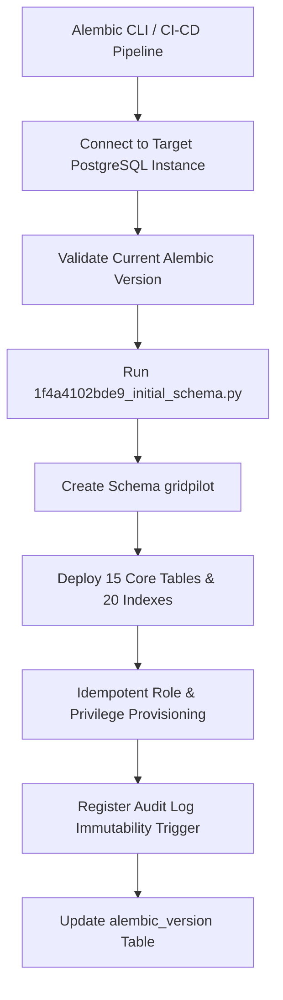
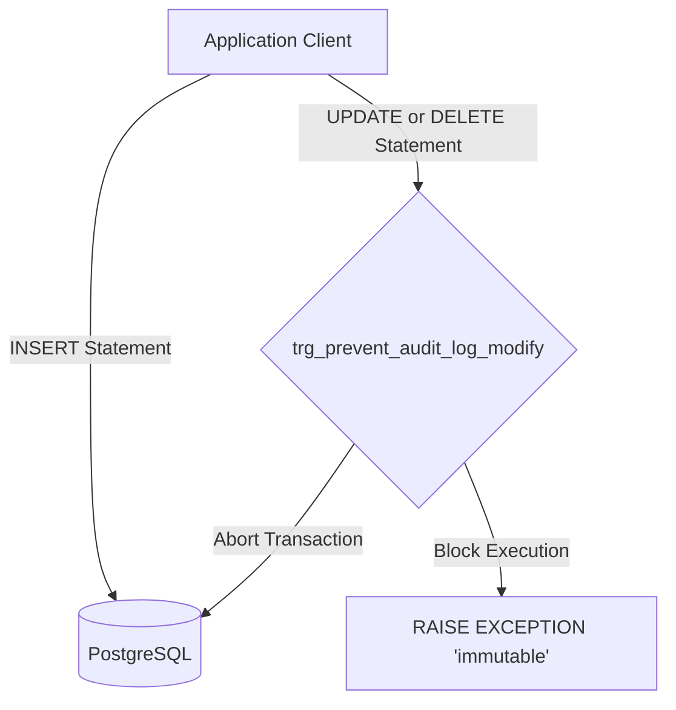

# Database Migration & Schema Security Strategy

This document details the database migration workflows, security controls, and recovery procedures designed for the GridPilot application. It serves as a guide to verify production-grade compliance, security isolation, and deployment maturity.

---

## 1. Upgrade Flow

GridPilot manages schema evolution using **Alembic** combined with **SQLAlchemy 2.0 AsyncEngine**. The upgrade process is automated and designed to run in containerized CI/CD pipelines or local development environments.



### Key Execution Steps
1. **Schema Isolation:** All application tables, custom types, and indices are hosted within the dedicated `gridpilot` database schema. This isolates application logic from PostgreSQL system tables and other database applications sharing the server.
2. **Execution Command:**
   ```bash
   # Execute all pending migrations up to target HEAD
   $env:PYTHONPATH="."
   py -m alembic upgrade head
   ```

---

## 2. Downgrade Flow

Alembic migrations are written symmetrically; every `upgrade()` operation has a corresponding `downgrade()` operation. This ensures that the schema can be reverted to a specific revision or a completely clean state (`base`) without leaving orphan resources.

### Rollback / Reversion Command:
```bash
# Revert all schema changes back to clean state
$env:PYTHONPATH="."
py -m alembic downgrade base
```

### Safety Features
- **Symmetric Drops:** `downgrade()` explicitly drops the custom schema, tables, indices, functions, and trigger definitions in reverse order of their creation to avoid foreign key dependency issues.
- **Idempotency:** Utilizes `DROP ... IF EXISTS` constructs within custom SQL executors to guarantee error-free execution even if tables or triggers were partially modified out-of-band.

---

## 3. Trigger Explanation (Audit Log Immutability)

The `audit_log` table serves as the system's absolute ledger for operations, actions, and security events. To guarantee compliance and security, the table is designed to be **immutable** (append-only). 

This is achieved via a PL/pgSQL database trigger running directly inside PostgreSQL.



### PL/pgSQL Function:
```sql
CREATE OR REPLACE FUNCTION gridpilot.prevent_audit_log_modification()
RETURNS TRIGGER AS $func$
BEGIN
    RAISE EXCEPTION 'audit_log table is append-only and immutable. UPDATE and DELETE operations are prohibited.';
END;
$func$ LANGUAGE plpgsql;
```

### Trigger Definition:
```sql
CREATE TRIGGER trg_prevent_audit_log_modify
BEFORE UPDATE OR DELETE ON gridpilot.audit_log
FOR EACH ROW
EXECUTE FUNCTION gridpilot.prevent_audit_log_modification();
```

### Why a Trigger?
- **Owner Bypass Resistance:** Unlike standard table privileges, database triggers are enforced on all connections—including the table owner and database superuser (`gridpilot_app`).
- **WORM Compliance:** Once a log entry is written, it can never be altered or purged through SQL commands, providing a tamper-proof audit trail.

---

## 4. Runtime Role Explanation (`gridpilot_runtime`)

To adhere to the **Principle of Least Privilege**, the application server does not connect as the database superuser or migration owner. Instead, it runs under the restricted `gridpilot_runtime` role.

### Isolation & Privilege Model
- **Superuser Isolation:** The schema, tables, and trigger functions are owned by `gridpilot_app` (used solely for migration deployments).
- **Restricted Access:** The `gridpilot_runtime` user is granted:
  - `USAGE` on the `gridpilot` schema.
  - `SELECT`, `INSERT`, `UPDATE`, and `DELETE` on all standard operational tables.
- **Audit Ledger Protection:** Privilege permissions explicitly `REVOKE` any `UPDATE` or `DELETE` capabilities on `audit_log` for the `gridpilot_runtime` role. If a malicious actor compromises the application server credentials, they cannot modify the audit trail.

### Portability & Privilege Awareness
When deploying to cloud-managed databases (e.g., Alibaba Cloud RDS, AWS RDS) where `CREATE ROLE` permissions might be restricted for the executing user:
- The migration checks user privileges dynamically.
- If role creation is unavailable, the migration outputs a warning but completes successfully without failing, allowing external security administrators to provision roles out-of-band.

---

## 5. Rollback Procedure (Disaster Recovery)

If a migration fails or an emergency rollback is required in production:

### Step 1: Stop the Application Server
Prevent any new client connection from modifying state or writing to tables.
```bash
# Example if using Docker Compose
docker-compose stop web-api
```

### Step 2: Perform Alembic Downgrade
Instruct Alembic to rollback to the last known stable revision (or `base`).
```bash
$env:PYTHONPATH="."
py -m alembic downgrade <stable-revision-id>
```

### Step 3: Verify Clean Reversion
Programmatically verify that tables, triggers, and indices have been successfully removed:
```bash
# Programmatic checks
py -m pytest GridPilot/services/db/tests/test_migrations.py
```

### Step 4: Restart Application Services
Once database consistency is verified, restart application traffic.
```bash
docker-compose start web-api
```
